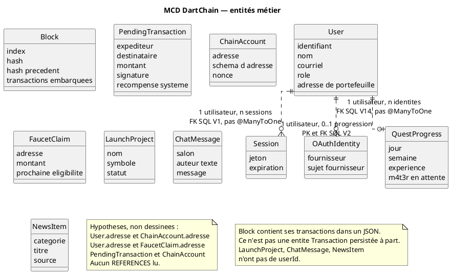

# 45 — Modèle conceptuel de données

## Objectif

Cette fiche est une vue complémentaire de la série documentaire 41–60. Elle présente les entités métier du canon, pas les dix-sept tables techniques. Les cardinalités qui reposent seulement sur une colonne `userId` sans clé étrangère sont marquées comme hypothèses. Celles qui s’appuient sur un `REFERENCES` lu dans une migration sont qualifiées de déduites du SQL, tout en rappelant l’absence de `@ManyToOne`.

## Statut

Élevé. Entités confirmées par le code. Cardinalités qualifiées une à une.

## Sources analysées

- Modèles et entités : `UserEntity`, `AuthSessionEntity`, `Block` / `BlockEntity`, `PendingTransaction` / `PendingTransactionEntity`, `ChainAccountEntity`, `FaucetClaimEntity`, `QuestProgressEntity`, `LaunchProjectEntity`, `ChatMessageEntity`, `NewsItemEntity`, `OAuthIdentityEntity`
- Migrations V1, V2, V6, V14 pour les liens utilisateur
- Absence de `@ManyToOne` dans le backend

Entités volontairement hors de ce MCD, bien qu’elles aient une table : jeton de rafraîchissement, journal d’audit, seau de rate limit, configuration de chaîne, ajustement de carnet, portefeuille d’amorçage d’échange. Elles relèvent du modèle logique (fiche 46).

## Éléments représentés

- `User` : compte applicatif, rôle, adresse de portefeuille optionnelle.
- `Session` : jeton de session rattaché à un utilisateur.
- `OAuthIdentity` : sujet chez un fournisseur, rattaché à un utilisateur.
- `QuestProgress` : une progression par utilisateur.
- `Block` : maillon de la chaîne native, transactions embarquées.
- `PendingTransaction` : transaction en attente, adresses textuelles.
- `ChainAccount` : compte de chaîne identifié par une adresse.
- `FaucetClaim` : réclamation indexée par adresse, pas par identifiant utilisateur.
- `LaunchProject`, `ChatMessage`, `NewsItem` : objets de vitrine sans lien conceptuel confirmé vers `User`.

## Diagramme

## Explication

Le MCD retient ce que le métier de la démo manipule : une personne inscrite, sa session, éventuellement une identité OAuth, une progression de quêtes, et à côté une chaîne native faite de blocs et d’un mempool. La vitrine (lancements, chat, actualités) et le faucet vivent dans le même processus sans que le schéma les rattache à `User`.

Cardinalités appuyées sur une contrainte SQL lue, donc déduites du schéma et non inventées, mais sans association JPA :

- Un `User` possède zéro ou plusieurs `Session`. `auth_sessions.user_id` est obligatoire et référence `users.id`.
- Un `User` possède zéro ou plusieurs `OAuthIdentity`. V14 impose l’unicité du couple fournisseur + sujet.
- Un `User` possède au plus une `QuestProgress`, car `user_id` est la clé primaire de `quest_progress` et référence `users.id`.

Cardinalités laissées en hypothèse, et non dessinées comme des liens :

- `FaucetClaim` vers `User` ou vers `ChainAccount`, parce que seule une colonne `wallet_address` existe, sans `REFERENCES`.
- `PendingTransaction.from_address` / `to_address` vers `ChainAccount.address`, même raison. V6 ne déclare aucune FK.
- `User.walletAddress` vers `ChainAccount.address` : les types et les largeurs SQL diffèrent (VARCHAR 128 contre VARCHAR 42), et aucune contrainte n’a été lue.

`ChatMessage.author` est un texte d’affichage. Le chat anonyme utilise la constante `ChatService.ANONYMOUS_AUTHOR`. Ce n’est pas une clé vers `User`. `NewsItem` et `LaunchProject` n’ont pas de colonne `userId`.

`Block` et `PendingTransaction` ne sont pas reliés par une FK. Au minage, les transactions quittent le mempool et sont sérialisées dans `transactions_json`. Conceptuellement, un bloc contient zéro ou plusieurs transactions ; cette inclusion est un document JSON, pas une entité fille.

## Correspondance avec le code

| Entité MCD | Ancrage |
| --- | --- |
| User | `UserEntity`, rôle chaîne `USER` par défaut, enum `UserRole` |
| Session | `AuthSessionEntity.token` |
| OAuthIdentity | `OAuthIdentityEntity` |
| QuestProgress | `QuestProgressEntity` |
| Block | `Block` (index, timestamp, data, transactions, previousHash, hash, nonce, difficulty) et `BlockEntity` |
| PendingTransaction | `PendingTransaction` et `PendingTransactionEntity` |
| ChainAccount | `ChainAccountEntity` |
| FaucetClaim | `FaucetClaimEntity` |
| LaunchProject | `LaunchProjectEntity` |
| ChatMessage | `ChatMessageEntity` |
| NewsItem | `NewsItemEntity` |

Les fournisseurs OAuth prévus dans la configuration, tous désactivés par défaut, sont google, meta, apple, microsoft, github, x et discord. Le MCD ne les représente pas comme des entités : ce sont des valeurs de `provider`.

## Hypothèses

- « 0..1 progression par utilisateur » suppose qu’aucune seconde ligne ne peut exister. C’est vrai tant que `user_id` reste la clé primaire, ce que V2 déclare.
- L’inclusion des transactions dans le bloc est conceptuelle. Le modèle Java `Block.transactions` est une `List<Transaction>` ; la table ne stocke qu’une chaîne JSON.
- Un message de chat dont `author` reprend un nom d’utilisateur n’est pas une association. Aucune colonne ne le prouve.

## Anomalies détectées

- Le vocabulaire « NFT » de `CharacterNftController` n’a pas d’entité de persistance dans ce MCD : l’API `/api/v1/characters` sert un personnage applicatif, pas un objet on-chain. Le détail est dans la fiche 58.
- La FAQ (`FaqQuestion`) est un concept métier sans entité persistée en mode postgres.
- `Session` coexiste avec les jetons de rafraîchissement et avec `legacy-session-enabled: false`. Le MCD ne montre que la session table `auth_sessions`, pas le cycle JWT complet (fiche 50).

## Recommandations

- Décider si l’adresse de portefeuille est un attribut de `User` ou un lien vers `ChainAccount`, puis l’écrire dans une migration. Tant que ce n’est pas fait, les diagrammes doivent garder l’hypothèse visible.
- Nommer la transaction confirmée comme valeur embarquée du bloc, pour ne pas laisser croire à une table `transactions`.
- Si la FAQ reste un concept produit, lui donner une entité de persistance ou la retirer du discours de données durables.
