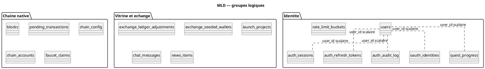

# 46 — Modèle logique de données

## Objectif

Cette fiche est une vue complémentaire de la série documentaire 41–60. Elle projette les tables et les colonnes confirmées à la fois par les entités Java et par le SQL Flyway lu. Elle ne complète pas une colonne absente de ces deux sources.

## Statut

Élevé. Confirmé par le code.

## Sources analysées

- Package `io.dartchain.backend.persistence.entity`
- Migrations `V1__auth.sql` à `V14__oauth_identities.sql`
- Classe identifiant `ExchangeLedgerAdjustmentId`

## Éléments représentés

Le modèle logique retient une ligne par table physique, avec le type Java du champ et le type SQL lu. Les identifiants scalaires `userId` restent des colonnes, pas des associations.

Groupes :

1. Identité et contrôle d’accès technique.
2. Chaîne native et faucet.
3. Échange, vitrine, chat, actualités.

## Diagramme

Le détail des colonnes est dans la correspondance. Les pointillés rappellent l’absence de `@ManyToOne`.

## Explication

Chaque table a une entité `@Table` homonyme, sauf la clé composée de l’ajustement de carnet qui est un `@Embeddable`. Les types Java ci-dessous sont ceux des champs privés lus. Les types SQL sont ceux des `CREATE TABLE` et `ALTER TABLE` lus, après application de V1 à V14.

Les colonnes JSON (`tasks_json`, `explored_blocks_json`, `transactions_json`) sont des `String` Java annotées `@JdbcTypeCode(SqlTypes.JSON)` et des `JSONB` SQL.

Aucun attribut logique n’a été ajouté pour une publicité : V12, malgré son nom `ad_persistence`, ne définit que des index, `chain_config` et `chain_accounts`.

## Correspondance avec le code

### Identité

| Colonne SQL | Champ Java | Type Java | Type SQL lu |
| --- | --- | --- | --- |
| `users.id` | `id` | `UUID` | `UUID` PK |
| `users.username` | `username` | `String` | `VARCHAR(64)` |
| `users.email` | `email` | `String` | `VARCHAR(255)` |
| `users.password_hash` | `passwordHash` | `String` | `VARCHAR(128)` |
| `users.password_salt` | `passwordSalt` | `String` | `VARCHAR(64)` |
| `users.wallet_address` | `walletAddress` | `String` | `VARCHAR(128)` |
| `users.wallet_public_key` | `walletPublicKey` | `String` | `TEXT` |
| `users.created_at` | `createdAt` | `Instant` | `TIMESTAMPTZ` |
| `users.role` | `role` | `String` | `VARCHAR(16)` ajouté en V11, défaut SQL `USER` |

| Colonne SQL | Champ Java | Type Java | Type SQL lu |
| --- | --- | --- | --- |
| `auth_sessions.token` | `token` | `UUID` | `UUID` PK |
| `auth_sessions.user_id` | `userId` | `UUID` | `UUID` FK |
| `auth_sessions.expires_at` | `expiresAt` | `Instant` | `TIMESTAMPTZ` |
| `auth_sessions.created_at` | `createdAt` | `Instant` | `TIMESTAMPTZ` |

`auth_refresh_tokens` reprend exactement les mêmes quatre colonnes et les mêmes types (`AuthRefreshTokenEntity`).

| Colonne SQL | Champ Java | Type Java | Type SQL lu |
| --- | --- | --- | --- |
| `auth_audit_log.id` | `id` | `UUID` | `UUID` PK |
| `auth_audit_log.user_id` | `userId` | `UUID` | `UUID` sans `REFERENCES` |
| `auth_audit_log.action` | `action` | `String` | `VARCHAR(64)` |
| `auth_audit_log.detail` | `detail` | `String` | `TEXT` |
| `auth_audit_log.ip_address` | `ipAddress` | `String` | `VARCHAR(64)` |
| `auth_audit_log.created_at` | `createdAt` | `Instant` | `TIMESTAMPTZ` |

| Colonne SQL | Champ Java | Type Java | Type SQL lu |
| --- | --- | --- | --- |
| `oauth_identities.id` | `id` | `UUID` | `UUID` PK |
| `oauth_identities.user_id` | `userId` | `UUID` | `UUID` FK |
| `oauth_identities.provider` | `provider` | `String` | `VARCHAR(32)` |
| `oauth_identities.provider_subject` | `providerSubject` | `String` | `VARCHAR(255)` |
| `oauth_identities.created_at` | `createdAt` | `Instant` | `TIMESTAMPTZ` |

| Colonne SQL | Champ Java | Type Java | Type SQL lu |
| --- | --- | --- | --- |
| `rate_limit_buckets.bucket_key` | `bucketKey` | `String` | `VARCHAR(256)` PK |
| `rate_limit_buckets.window_start_ms` | `windowStartMs` | `long` | `BIGINT` |
| `rate_limit_buckets.request_count` | `requestCount` | `int` | `INT` |
| `rate_limit_buckets.updated_at` | `updatedAt` | `Instant` | `TIMESTAMPTZ` |

| Colonne SQL | Champ Java | Type Java | Type SQL lu |
| --- | --- | --- | --- |
| `quest_progress.user_id` | `userId` | `UUID` | `UUID` PK et FK |
| `quest_progress.day_key` | `dayKey` | `String` | `VARCHAR(10)` |
| `quest_progress.week_key` | `weekKey` | `String` | `VARCHAR(8)` ajouté en V3 |
| `quest_progress.tasks_json` | `tasksJson` | `String` | `JSONB` |
| `quest_progress.explored_blocks_json` | `exploredBlocksJson` | `String` | `JSONB` ajouté en V5 |
| `quest_progress.mission_claimed` | `missionClaimed` | `boolean` | `BOOLEAN` |
| `quest_progress.weekly_claimed` | `weeklyClaimed` | `boolean` | `BOOLEAN` |
| `quest_progress.total_xp` | `totalXp` | `int` | `INT` |
| `quest_progress.pending_mts` | `pendingMts` | `BigDecimal` | `NUMERIC(18,2)` |
| `quest_progress.updated_at` | `updatedAt` | `Instant` | `TIMESTAMPTZ` |

### Chaîne native

| Colonne SQL | Champ Java | Type Java | Type SQL lu |
| --- | --- | --- | --- |
| `blocks.block_index` | `blockIndex` | `int` | `INT` PK |
| `blocks.block_timestamp` | `blockTimestamp` | `long` | `BIGINT` |
| `blocks.block_data` | `blockData` | `String` | `TEXT` |
| `blocks.previous_hash` | `previousHash` | `String` | `VARCHAR(128)` |
| `blocks.block_hash` | `blockHash` | `String` | `VARCHAR(128)` |
| `blocks.nonce` | `nonce` | `int` | `INT` |
| `blocks.difficulty` | `difficulty` | `int` | `INT` |
| `blocks.transactions_json` | `transactionsJson` | `String` | `JSONB` |

| Colonne SQL | Champ Java | Type Java | Type SQL lu |
| --- | --- | --- | --- |
| `pending_transactions.id` | `id` | `String` | `VARCHAR(36)` PK |
| `pending_transactions.tx_hash` | `txHash` | `String` | `VARCHAR(128)` |
| `pending_transactions.from_address` | `fromAddress` | `String` | `VARCHAR(128)` |
| `pending_transactions.to_address` | `toAddress` | `String` | `VARCHAR(128)` |
| `pending_transactions.amount` | `amount` | `BigDecimal` | `NUMERIC(38,26)` |
| `pending_transactions.tx_data` | `txData` | `String` | `TEXT` |
| `pending_transactions.signature` | `signature` | `String` | `TEXT` |
| `pending_transactions.status` | `status` | `String` | `VARCHAR(32)` |
| `pending_transactions.system_reward` | `systemReward` | `boolean` | `BOOLEAN` |
| `pending_transactions.created_at` | `createdAt` | `long` | `BIGINT` |

| Colonne SQL | Champ Java | Type Java | Type SQL lu |
| --- | --- | --- | --- |
| `chain_config.config_key` | `configKey` | `String` | `VARCHAR(64)` PK |
| `chain_config.config_value` | `configValue` | `String` | `TEXT` |
| `chain_accounts.address` | `address` | `String` | `VARCHAR(42)` PK |
| `chain_accounts.address_scheme` | `addressScheme` | `String` | `VARCHAR(16)` |
| `chain_accounts.public_key` | `publicKey` | `String` | `TEXT` |
| `chain_accounts.nonce` | `nonce` | `long` | `BIGINT` |
| `chain_accounts.created_at` | `createdAt` | `long` | `BIGINT` |

| Colonne SQL | Champ Java | Type Java | Type SQL lu |
| --- | --- | --- | --- |
| `faucet_claims.id` | `id` | `String` | `VARCHAR(36)` PK |
| `faucet_claims.wallet_address` | `walletAddress` | `String` | `VARCHAR(128)` |
| `faucet_claims.amount` | `amount` | `BigDecimal` | `NUMERIC(38,26)` |
| `faucet_claims.claimed_at` | `claimedAt` | `long` | `BIGINT` |
| `faucet_claims.next_eligible_at` | `nextEligibleAt` | `long` | `BIGINT` |
| `faucet_claims.tx_hash` | `txHash` | `String` | `VARCHAR(128)` |
| `faucet_claims.client_id` | `clientId` | `String` | `VARCHAR(128)` |
| `faucet_claims.created_at` | `createdAt` | `Instant` | `TIMESTAMPTZ` |

### Vitrine et échange

| Colonne SQL | Champ Java | Type Java | Type SQL lu |
| --- | --- | --- | --- |
| `exchange_ledger_adjustments.wallet_address` | `id.walletAddress` | `String` | `VARCHAR(128)` PK |
| `exchange_ledger_adjustments.token` | `id.token` | `String` | `VARCHAR(16)` PK |
| `exchange_ledger_adjustments.adjustment` | `adjustment` | `BigDecimal` | `NUMERIC(38,8)` |
| `exchange_seeded_wallets.wallet_address` | `walletAddress` | `String` | `VARCHAR(128)` PK |

| Colonne SQL | Champ Java | Type Java | Type SQL lu |
| --- | --- | --- | --- |
| `launch_projects.id` | `id` | `String` | `VARCHAR(64)` PK |
| `launch_projects.name` | `name` | `String` | `VARCHAR(128)` |
| `launch_projects.symbol` | `symbol` | `String` | `VARCHAR(16)` unique |
| `launch_projects.status` | `status` | `String` | `VARCHAR(16)` |
| `launch_projects.raised_amount` | `raisedAmount` | `BigDecimal` | `NUMERIC(18,2)` |
| `launch_projects.target_amount` | `targetAmount` | `BigDecimal` | `NUMERIC(18,2)` |
| `launch_projects.created_at` | `createdAt` | `Instant` | `TIMESTAMPTZ` |
| `launch_projects.logo_url` | `logoUrl` | `String` | `TEXT` |
| `launch_projects.description` | `description` | `String` | `TEXT` |
| `launch_projects.chain` | `chain` | `String` | `VARCHAR(64)` |
| `launch_projects.whitepaper_url` | `whitepaperUrl` | `String` | `TEXT` ajouté en V13 |
| `launch_projects.website` | `website` | `String` | `TEXT` ajouté en V13 |
| `launch_projects.launch_date` | `launchDate` | `String` | `VARCHAR(40)` ajouté en V13 |

`chat_messages` (`ChatMessageEntity`) : `id` `String` VARCHAR(36) PK, `roomId` `String` VARCHAR(64), `author` `String` VARCHAR(128), `messageText` `String` TEXT, `sentAt` `Instant`, `clientId` `String` VARCHAR(64), `fontKey` `String` VARCHAR(32), `fontSize` `String` VARCHAR(8), `bold` `boolean`, `italic` `boolean`, `underline` `boolean`, `strikethrough` `boolean`, `fontColor` `String` VARCHAR(16), `highlightColor` `String` VARCHAR(16), `textAlign` `String` VARCHAR(16), `styleKey` `String` VARCHAR(32).

`news_items` (`NewsItemEntity`) : `id` `String` VARCHAR(64) PK, `category` `String` VARCHAR(64), `title` `String` TEXT, `summary` `String` TEXT, `body` `String` TEXT, `publishedAt` `Instant`, `source` `String` VARCHAR(16), `actionType` `String` VARCHAR(32), `actionTarget` `String` TEXT.

Le modèle objet `Transaction` (id, hash, sender, recipient, amount, timestamp, signature, systemReward, payload, status) n’a pas de table. Il est embarqué dans `blocks.transactions_json`. Le mempool persiste `PendingTransactionEntity`, dont les noms de colonnes (`from_address`, `tx_data`) diffèrent des noms du record métier (`sender`, `payload`).

## Hypothèses

- L’ordre logique des groupes ne prescrit pas d’ordre de jointure. Il suit le découpage des migrations.
- `users.role` est une chaîne de 16 caractères. L’enum `UserRole` n’est pas un type SQL enum ; la conversion se fait dans le code (`UserRole.fromValue`).

## Anomalies détectées

- Deux horloges : `Instant` pour l’authentification et la vitrine, `long` pour le mempool, les blocs, les comptes de chaîne et les dates de faucet (`claimed_at`, `next_eligible_at`).
- `Transaction.payload` n’a pas d’homologue nommé `payload` en base : la colonne mempool s’appelle `tx_data`.
- La FAQ n’apparaît pas dans ce MLD postgres. Son store postgres est mémoire vive.

## Recommandations

- Documenter le mapping `PendingTransaction` → `PendingTransactionEntity` à côté de `PendingTransactionMapper`, déjà présent dans le paquet blockchain, pour figer `payload` / `tx_data` et `sender` / `from_address`.
- Éviter d’ajouter une table `transactions` sans migration : le logique actuel est « JSON dans le bloc ».
- Si `role` doit rester un vocabulaire fermé, une contrainte SQL `CHECK (role IN ('USER','ADMIN'))` rendrait le MLD aussi strict que l’enum. Elle n’existe pas dans V11.
