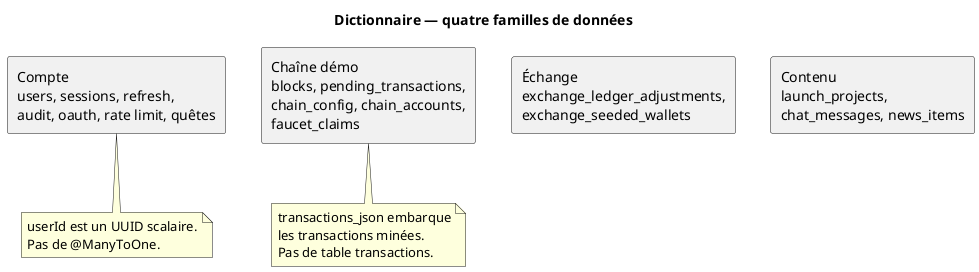

# 47 — Dictionnaire de données

## Objectif

Cette fiche est une vue complémentaire de la série documentaire 41–60. Elle reprend les champs utiles des dix-sept tables, avec le type Java lu sur l’entité. La nullabilité JPA n’est pas recopiée ligne à ligne dans ce dictionnaire. Elle se lit sur les `@Column` des entités, par exemple `nullable = false` sur `UserEntity.username`. Lorsqu’une migration ouverte contient `NOT NULL`, la contrainte SQL est citée à part, comme fait de schéma, distinct de l’annotation Java.

## Statut

Élevé. Champs et types confirmés par les entités et le SQL lus.

## Sources analysées

- Entités `io.dartchain.backend.persistence.entity`
- Migrations V1 à V14 lues intégralement
- Mémo de faits : liste des champs, sans annotations `nullable`

Les valeurs de secrets, hash de seed et mots de passe par défaut ne figurent pas dans ce dictionnaire.

## Éléments représentés

Pour chaque colonne : nom SQL, champ Java, type Java, rôle, contrainte SQL lue. Abréviations : PK clé primaire, FK clé étrangère lue, UQ unicité lue.

## Diagramme

## Explication

Le dictionnaire sert de légende aux fiches 44, 46 et 48. Il ne duplique pas les diagrammes de cardinalité. Une colonne marquée « SQL NOT NULL » l’est parce que le script Flyway lu le dit. L’absence de mention dans ce dictionnaire ne signifie pas que la colonne est facultative côté JPA : il faut lire le `@Column` de l’entité.

Unités métier rappelées par `chain_config` (insert V12) : chain-id `3377`, réseau « DartChain Native », jeton `R4V3`, schéma d’adresse par défaut `evm-compatible`, version de payload `DCv1`. La micro-unité M4T3R est un vocabulaire produit ; elle n’est pas une colonne de `chain_config`.

### users — `UserEntity`

| Colonne | Champ | Type Java | Contrainte SQL lue | Rôle |
| --- | --- | --- | --- | --- |
| `id` | `id` | `UUID` | PK | Identifiant de compte |
| `username` | `username` | `String` | NOT NULL, UNIQUE, VARCHAR(64) | Nom affiché / login |
| `email` | `email` | `String` | NOT NULL, UNIQUE, VARCHAR(255) | Courriel |
| `password_hash` | `passwordHash` | `String` | NOT NULL, VARCHAR(128) | Empreinte du mot de passe, pas le secret en clair |
| `password_salt` | `passwordSalt` | `String` | NOT NULL, VARCHAR(64) | Sel de mot de passe |
| `wallet_address` | `walletAddress` | `String` | VARCHAR(128), index | Adresse associée, optionnelle en SQL (pas de NOT NULL) |
| `wallet_public_key` | `walletPublicKey` | `String` | TEXT | Clé publique, pas une clé privée |
| `created_at` | `createdAt` | `Instant` | NOT NULL, TIMESTAMPTZ, défaut NOW() | Création |
| `role` | `role` | `String` | NOT NULL, VARCHAR(16), défaut `USER` (V11) | Rôle persisté, valeurs d’enum `USER` et `ADMIN` |

### auth_sessions — `AuthSessionEntity`

| Colonne | Champ | Type Java | Contrainte SQL lue | Rôle |
| --- | --- | --- | --- | --- |
| `token` | `token` | `UUID` | PK | Jeton de session |
| `user_id` | `userId` | `UUID` | NOT NULL, FK → `users.id` ON DELETE CASCADE | Propriétaire, scalaire en JPA |
| `expires_at` | `expiresAt` | `Instant` | NOT NULL | Expiration |
| `created_at` | `createdAt` | `Instant` | NOT NULL, défaut NOW() | Création |

### auth_refresh_tokens — `AuthRefreshTokenEntity`

Mêmes colonnes et types que `auth_sessions`. FK identique dans V11. Le TTL configuré dans `application.yaml` est 604800 secondes pour le rafraîchissement, 3600 secondes pour l’accès JWT. Ces durées ne sont pas des colonnes.

### auth_audit_log — `AuthAuditLogEntity`

| Colonne | Champ | Type Java | Contrainte SQL lue | Rôle |
| --- | --- | --- | --- | --- |
| `id` | `id` | `UUID` | PK | Ligne d’audit |
| `user_id` | `userId` | `UUID` | pas de NOT NULL, pas de FK lue | Compte concerné, peut manquer |
| `action` | `action` | `String` | NOT NULL, VARCHAR(64) | Verbe d’audit, ex. `auth.refresh` |
| `detail` | `detail` | `String` | TEXT | Détail libre |
| `ip_address` | `ipAddress` | `String` | VARCHAR(64) | Adresse IP enregistrée |
| `created_at` | `createdAt` | `Instant` | NOT NULL, défaut NOW() | Horodatage |

### oauth_identities — `OAuthIdentityEntity`

| Colonne | Champ | Type Java | Contrainte SQL lue | Rôle |
| --- | --- | --- | --- | --- |
| `id` | `id` | `UUID` | PK | Identité locale |
| `user_id` | `userId` | `UUID` | NOT NULL, FK CASCADE | Compte DartChain |
| `provider` | `provider` | `String` | NOT NULL, VARCHAR(32) | Fournisseur |
| `provider_subject` | `providerSubject` | `String` | NOT NULL, VARCHAR(255), UQ avec provider | Sujet distant |
| `created_at` | `createdAt` | `Instant` | NOT NULL, défaut NOW() | Lien créé |

### rate_limit_buckets — `RateLimitBucketEntity`

| Colonne | Champ | Type Java | Contrainte SQL lue | Rôle |
| --- | --- | --- | --- | --- |
| `bucket_key` | `bucketKey` | `String` | PK VARCHAR(256) | Clé de fenêtre |
| `window_start_ms` | `windowStartMs` | `long` | NOT NULL | Début de fenêtre en millisecondes |
| `request_count` | `requestCount` | `int` | NOT NULL | Compteur |
| `updated_at` | `updatedAt` | `Instant` | NOT NULL, défaut NOW() | Dernière mise à jour |

Le plafond produit lu dans `application.yaml` est 60 requêtes par 60000 ms. Ce n’est pas une colonne.

### quest_progress — `QuestProgressEntity`

| Colonne | Champ | Type Java | Contrainte SQL lue | Rôle |
| --- | --- | --- | --- | --- |
| `user_id` | `userId` | `UUID` | PK et FK CASCADE | Une progression par compte |
| `day_key` | `dayKey` | `String` | NOT NULL, VARCHAR(10) | Jour de mission |
| `week_key` | `weekKey` | `String` | NOT NULL après V3, VARCHAR(8) | Semaine |
| `tasks_json` | `tasksJson` | `String` | NOT NULL, JSONB | Tâches sérialisées |
| `explored_blocks_json` | `exploredBlocksJson` | `String` | NOT NULL, JSONB, défaut `[]` (V5) | Blocs explorés |
| `mission_claimed` | `missionClaimed` | `boolean` | NOT NULL, défaut FALSE | Mission du jour réclamée |
| `weekly_claimed` | `weeklyClaimed` | `boolean` | NOT NULL, défaut FALSE | Mission de semaine réclamée |
| `total_xp` | `totalXp` | `int` | NOT NULL, défaut 0 | Expérience |
| `pending_mts` | `pendingMts` | `BigDecimal` | NOT NULL, NUMERIC(18,2), défaut 0 | M4T3R en attente |
| `updated_at` | `updatedAt` | `Instant` | NOT NULL, défaut NOW() | Mise à jour |

### faucet_claims — `FaucetClaimEntity`

| Colonne | Champ | Type Java | Contrainte SQL lue | Rôle |
| --- | --- | --- | --- | --- |
| `id` | `id` | `String` | PK VARCHAR(36) | Identifiant de claim |
| `wallet_address` | `walletAddress` | `String` | NOT NULL, VARCHAR(128) | Adresse créditée, sans FK |
| `amount` | `amount` | `BigDecimal` | NOT NULL, NUMERIC(38,26) | Montant |
| `claimed_at` | `claimedAt` | `long` | NOT NULL | Horodatage epoch |
| `next_eligible_at` | `nextEligibleAt` | `long` | NOT NULL | Prochaine éligibilité |
| `tx_hash` | `txHash` | `String` | VARCHAR(128) | Hash de transaction associé |
| `client_id` | `clientId` | `String` | VARCHAR(128) | Client appelant |
| `created_at` | `createdAt` | `Instant` | NOT NULL, défaut NOW() | Insertion |

### blocks — `BlockEntity`

| Colonne | Champ | Type Java | Contrainte SQL lue | Rôle |
| --- | --- | --- | --- | --- |
| `block_index` | `blockIndex` | `int` | PK | Hauteur |
| `block_timestamp` | `blockTimestamp` | `long` | NOT NULL | Horodatage du bloc |
| `block_data` | `blockData` | `String` | TEXT, nullable en SQL | Donnée héritée, peut être vide |
| `previous_hash` | `previousHash` | `String` | NOT NULL, VARCHAR(128) | Hash du bloc précédent |
| `block_hash` | `blockHash` | `String` | NOT NULL, VARCHAR(128), index | Hash du bloc |
| `nonce` | `nonce` | `int` | NOT NULL | Preuve de travail locale |
| `difficulty` | `difficulty` | `int` | NOT NULL | Difficulté |
| `transactions_json` | `transactionsJson` | `String` | NOT NULL, JSONB, défaut `[]` | Transactions confirmées |

Le modèle `Block` porte en plus `List<Transaction> transactions`, reconstruit depuis ce JSON. Champs de `Transaction` : `id`, `hash`, `sender`, `recipient`, `amount` (`BigDecimal`), `timestamp` (`Long`), `signature`, `systemReward` (`Boolean`), `payload`, `status`, tous de type objet Java, sans table.

### pending_transactions — `PendingTransactionEntity`

| Colonne | Champ | Type Java | Contrainte SQL lue | Rôle |
| --- | --- | --- | --- | --- |
| `id` | `id` | `String` | PK VARCHAR(36) | Identifiant mempool |
| `tx_hash` | `txHash` | `String` | VARCHAR(128) | Hash |
| `from_address` | `fromAddress` | `String` | NOT NULL, VARCHAR(128) | Expéditeur |
| `to_address` | `toAddress` | `String` | NOT NULL, VARCHAR(128) | Destinataire |
| `amount` | `amount` | `BigDecimal` | NOT NULL, NUMERIC(38,26) | Montant |
| `tx_data` | `txData` | `String` | TEXT | Charge utile |
| `signature` | `signature` | `String` | TEXT | Signature, absente permise en SQL |
| `status` | `status` | `String` | VARCHAR(32) | État |
| `system_reward` | `systemReward` | `boolean` | NOT NULL, défaut FALSE | Récompense système, pas un journal d’événements |
| `created_at` | `createdAt` | `long` | NOT NULL | Création epoch |

### chain_config — `ChainConfigEntity`

| Colonne | Champ | Type Java | Contrainte SQL lue | Rôle |
| --- | --- | --- | --- | --- |
| `config_key` | `configKey` | `String` | PK VARCHAR(64) | Clé, ex. `chainId` |
| `config_value` | `configValue` | `String` | NOT NULL, TEXT | Valeur texte |

### chain_accounts — `ChainAccountEntity`

| Colonne | Champ | Type Java | Contrainte SQL lue | Rôle |
| --- | --- | --- | --- | --- |
| `address` | `address` | `String` | PK VARCHAR(42) | Adresse |
| `address_scheme` | `addressScheme` | `String` | NOT NULL, VARCHAR(16), défaut `evm` | Schéma |
| `public_key` | `publicKey` | `String` | TEXT | Clé publique |
| `nonce` | `nonce` | `long` | NOT NULL, défaut 0 | Compteur |
| `created_at` | `createdAt` | `long` | NOT NULL | Création epoch |

### exchange_ledger_adjustments — `ExchangeLedgerAdjustmentEntity`

| Colonne | Champ | Type Java | Contrainte SQL lue | Rôle |
| --- | --- | --- | --- | --- |
| `wallet_address` | `id.walletAddress` | `String` | PK composée, VARCHAR(128) | Adresse |
| `token` | `id.token` | `String` | PK composée, VARCHAR(16) | Symbole |
| `adjustment` | `adjustment` | `BigDecimal` | NOT NULL, NUMERIC(38,8) | Ajustement de solde |

### exchange_seeded_wallets — `ExchangeSeededWalletEntity`

| Colonne | Champ | Type Java | Contrainte SQL lue | Rôle |
| --- | --- | --- | --- | --- |
| `wallet_address` | `walletAddress` | `String` | PK VARCHAR(128) | Portefeuille déjà amorcé |

### launch_projects — `LaunchProjectEntity`

| Colonne | Champ | Type Java | Contrainte SQL lue | Rôle |
| --- | --- | --- | --- | --- |
| `id` | `id` | `String` | PK VARCHAR(64) | Projet |
| `name` | `name` | `String` | NOT NULL, VARCHAR(128) | Nom |
| `symbol` | `symbol` | `String` | NOT NULL, UNIQUE, VARCHAR(16) | Symbole |
| `status` | `status` | `String` | NOT NULL, VARCHAR(16) | Statut |
| `raised_amount` | `raisedAmount` | `BigDecimal` | NOT NULL, NUMERIC(18,2) | Montant levé |
| `target_amount` | `targetAmount` | `BigDecimal` | NOT NULL, NUMERIC(18,2) | Objectif |
| `created_at` | `createdAt` | `Instant` | NOT NULL | Création |
| `logo_url` | `logoUrl` | `String` | TEXT | Logo |
| `description` | `description` | `String` | TEXT | Description |
| `chain` | `chain` | `String` | VARCHAR(64) | Chaîne affichée |
| `whitepaper_url` | `whitepaperUrl` | `String` | TEXT (V13) | Livre blanc |
| `website` | `website` | `String` | TEXT (V13) | Site |
| `launch_date` | `launchDate` | `String` | VARCHAR(40) (V13) | Date texte, pas un timestamp |

### chat_messages — `ChatMessageEntity`

| Colonne | Champ | Type Java | Contrainte SQL lue | Rôle |
| --- | --- | --- | --- | --- |
| `id` | `id` | `String` | PK VARCHAR(36) | Message |
| `room_id` | `roomId` | `String` | NOT NULL, VARCHAR(64) | Salon |
| `author` | `author` | `String` | NOT NULL, VARCHAR(128) | Auteur affiché |
| `message_text` | `messageText` | `String` | NOT NULL, TEXT | Texte |
| `sent_at` | `sentAt` | `Instant` | NOT NULL | Envoi |
| `client_id` | `clientId` | `String` | VARCHAR(64) | Client |
| `font_key` | `fontKey` | `String` | VARCHAR(32) | Police |
| `font_size` | `fontSize` | `String` | VARCHAR(8) | Taille |
| `bold` | `bold` | `boolean` | NOT NULL, défaut FALSE | Gras |
| `italic` | `italic` | `boolean` | NOT NULL, défaut FALSE | Italique |
| `underline` | `underline` | `boolean` | NOT NULL, défaut FALSE | Souligné |
| `strikethrough` | `strikethrough` | `boolean` | NOT NULL, défaut FALSE | Barré |
| `font_color` | `fontColor` | `String` | VARCHAR(16) | Couleur |
| `highlight_color` | `highlightColor` | `String` | VARCHAR(16) | Surlignage |
| `text_align` | `textAlign` | `String` | VARCHAR(16) | Alignement |
| `style_key` | `styleKey` | `String` | VARCHAR(32) | Style nommé |

### news_items — `NewsItemEntity`

| Colonne | Champ | Type Java | Contrainte SQL lue | Rôle |
| --- | --- | --- | --- | --- |
| `id` | `id` | `String` | PK VARCHAR(64) | Article |
| `category` | `category` | `String` | NOT NULL, VARCHAR(64) | Catégorie |
| `title` | `title` | `String` | NOT NULL, TEXT | Titre |
| `summary` | `summary` | `String` | TEXT | Résumé |
| `body` | `body` | `String` | TEXT | Corps |
| `published_at` | `publishedAt` | `Instant` | NOT NULL | Publication |
| `source` | `source` | `String` | NOT NULL, VARCHAR(16) | Source |
| `action_type` | `actionType` | `String` | VARCHAR(32) | Type d’action UI |
| `action_target` | `actionTarget` | `String` | TEXT | Cible d’action |

### Hors tables

`FaqQuestion` et `FaqQuestionStatus` (`ACTIVE`, `PINNED`, `ARCHIVED` utilisés par `CommunityFaqService`) n’ont pas de ligne dans ce dictionnaire relationnel : pas de table Flyway. En mode postgres le store est `InMemoryFaqQuestionStore`.

## Correspondance avec le code

Les annotations de longueur JPA (`length = 64`, `precision`, `scale`) coïncident avec les VARCHAR et NUMERIC cités pour les colonnes relues. Les écarts de nom sont localisés : `block_index` / `blockIndex`, `message_text` / `messageText`, `from_address` / `fromAddress`, `tx_data` / `txData`.

## Hypothèses

- Le défaut SQL `USER` sur `users.role` et le défaut Java `role = "USER"` décrivent la même intention. Le dictionnaire ne prouve pas qu’Hibernate et Flyway s’alignent si une ligne est insérée sans passer par l’entité.
- `launch_date` en VARCHAR est une date d’affichage. Aucun format n’est imposé par le SQL lu.

## Anomalies détectées

- La nullabilité JPA est dans les `@Column` des entités. Ce dictionnaire privilégie le type Java et le `NOT NULL` SQL déjà lu. Croiser l’entité si la contrainte JPA est nécessaire.
- `wallet_public_key` et `signature` peuvent être vides en SQL alors que d’autres secrets de compte (`password_hash`) sont NOT NULL.
- `chain_accounts.address` est limité à 42 caractères, `users.wallet_address` à 128. Le dictionnaire ne les fusionne pas.
- Pas d’entrée `faq_questions`.

## Recommandations

- Aligner ce dictionnaire sur une colonne unique de nullabilité, prise des `@Column` et des `NOT NULL` Flyway.
- Publier ce dictionnaire à côté de Flyway lors de chaque migration nouvelle, en particulier si une table publicitaire venait s’ajouter sous un nom autre que V12.
- Traiter `system_reward` comme un booléen de transaction, pas comme un type d’événement on-chain (fiche 59).
