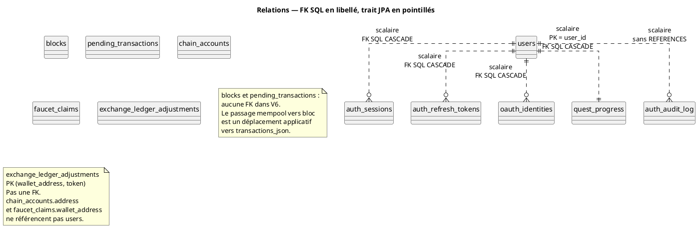

# 48 — Relations entre tables

## Objectif

Cette fiche est une vue complémentaire de la série documentaire 41–60. Elle classe les relations réellement portées par le schéma : clés étrangères SQL d’un côté, colonnes `userId` scalaires sans association JPA de l’autre, et la clé composée `walletAddress` + `token` du carnet d’échange.

## Statut

Élevé. Confirmé par le code et le SQL lus.

## Sources analysées

- Entités JPA du package `persistence.entity` : aucune `@ManyToOne`, `@OneToMany`, `@ManyToMany`
- `V1__auth.sql`, `V2__quests.sql`, `V6__blockchain.sql`, `V7__exchange_ledger.sql`, `V11__auth_ab.sql`, `V14__oauth_identities.sql`
- `ExchangeLedgerAdjustmentId`

## Éléments représentés

- Quatre FK SQL vers `users.id`, non mappées en associations JPA.
- Un `user_id` d’audit sans `REFERENCES`.
- Des colonnes d’adresse sans FK.
- Une clé primaire composée, qui n’est pas une relation vers une autre table.
- L’absence de relation entre `blocks` et `pending_transactions`.

## Diagramme

Légende : le trait pointillé signifie « pas d’association JPA ». Le texte du lien dit si PostgreSQL, lui, a une contrainte.

## Explication

JPA identifie les lignes par `@Id` ou `@EmbeddedId` et stocke `userId` comme une colonne UUID. Le chargement d’une session ne charge pas l’objet `UserEntity` par navigation. Les services qui ont besoin du compte passent par les stores (`JpaUserAccountStore`, `JpaSessionStore`, etc.), pas par un graphe d’entités.

Côté SQL, la suppression d’un utilisateur emporte, par `ON DELETE CASCADE` :

- ses sessions (V1) ;
- ses jetons de rafraîchissement (V11) ;
- ses identités OAuth (V14) ;
- sa progression de quêtes (V2), dont `user_id` est aussi la clé primaire, donc au plus une ligne.

Le journal `auth_audit_log.user_id` reste en place si l’on se fie au SQL lu : pas de cascade, pas de FK. Une suppression d’utilisateur peut laisser des lignes d’audit orphelines. C’est une relation logique faible.

`exchange_ledger_adjustments` ne pointe pas vers `users` ni vers `chain_accounts`. Sa clé `(wallet_address, token)` identifie un ajustement. Deux jetons pour la même adresse sont deux lignes. `exchange_seeded_wallets` est un ensemble d’adresses, clé simple, sans colonne supplémentaire et sans FK.

`blocks.transactions_json` n’est pas une clé étrangère vers `pending_transactions`. Après minage, la transaction confirmée vit dans le JSON du bloc. Les index V12 sur `from_address` et `to_address` accélèrent les recherches ; ils ne créent pas une intégrité référentielle.

Aucune relation n’est déclarée entre `chat_messages.author` et `users.username`, ni entre `news_items` ou `launch_projects` et un compte.

## Correspondance avec le code

| Relation | JPA | SQL lu |
| --- | --- | --- |
| User — sessions | `AuthSessionEntity.userId` scalaire | `REFERENCES users(id) ON DELETE CASCADE` |
| User — refresh | `AuthRefreshTokenEntity.userId` scalaire | idem V11 |
| User — OAuth | `OAuthIdentityEntity.userId` scalaire | idem V14, plus UQ `(provider, provider_subject)` |
| User — quêtes | `QuestProgressEntity.userId` est l’`@Id` | PK et FK V2 |
| User — audit | `AuthAuditLogEntity.userId` scalaire, colonne sans `nullable = false` dans l’entité lue | index seulement |
| Portefeuille — ajustement | `@EmbeddedId` `walletAddress` + `token` | `PRIMARY KEY (wallet_address, token)` |
| Bloc — mempool | aucun champ commun mappé en relation | aucune FK dans V6 |
| User — compte de chaîne | `UserEntity.walletAddress` et `ChainAccountEntity.address` séparés | aucune FK |

Les dépôts mémoire (`JsonUserAccountStore`, `InMemorySessionStore`, …) n’ont pas non plus de lien objet : ce sont des collections ou des fichiers indépendants, coordonnés par les services.

## Hypothèses

- La cardinalité 1–1 entre utilisateur et progression suppose que l’application n’insère pas une seconde ligne avec le même UUID. La PK SQL l’interdit en mode postgres. En mode JSON, cette unicité dépend du store, non relue ligne à ligne ici.
- L’absence de FK d’adresse est traitée comme un choix de schéma actuel, pas comme un oubli prouvé.

## Anomalies détectées

- L’intégrité des sessions est déléguée à PostgreSQL alors que le modèle Java l’ignore. Un outil qui supprimerait des lignes via JDBC en contournant Flyway hériterait des cascades ; un store JSON ne les reproduit pas.
- Largeurs d’adresse incompatibles pour une future FK : 128 caractères côté utilisateur et faucet, 42 côté `chain_accounts`.
- `rate_limit_buckets` n’a aucune relation avec `users`. Le seau est une clé opaque. C’est cohérent avec un limiteur par requête, et cela empêche de rattacher un abus à un compte par jointure.

## Recommandations

- Choisir un style unique : soit les FK restent un détail PostgreSQL et les stores documentent les suppressions, soit les entités déclarent `@ManyToOne(optional = false)` là où V1, V2, V11 et V14 ont déjà la contrainte.
- Ne pas modéliser `(wallet_address, token)` comme une association vers une table de jetons : cette table n’existe pas. Le symbole est une colonne de la clé.
- Si l’audit doit survivre à la suppression du compte, le garder sans FK et l’écrire dans la politique de rétention. Si au contraire il doit suivre le compte, ajouter la contrainte dans une migration nouvelle, sans l’inventer dans le diagramme actuel.
