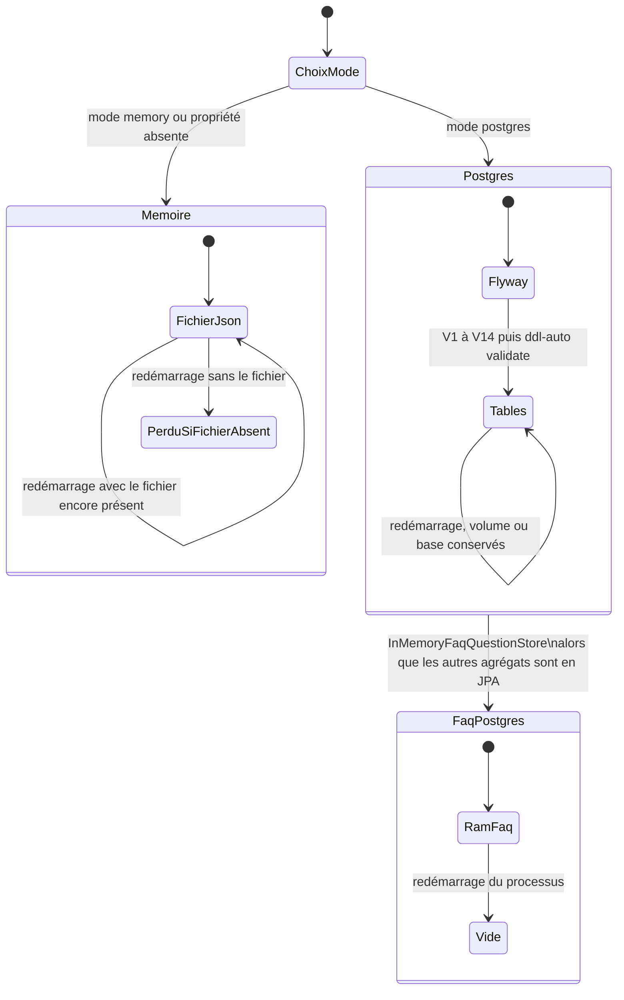

# 49 — Cycle de vie des données

## Objectif

Cette fiche est une vue complémentaire de la série documentaire 41–60. Elle décrit ce qui survit à un redémarrage selon le mode de persistance : fichiers JSON en mode `memory`, schéma Flyway et tables PostgreSQL en mode `postgres`. Elle signale le cas confirmé de la FAQ, volatile en RAM alors même que le mode postgres est actif.

## Statut

Moyen. Partiellement confirmé : le branchement des stores est lu dans le code ; la durabilité exacte après redémarrage dépend de la présence des fichiers sur le disque, ce qui est déduit du mécanisme JSON et non mesuré par un essai d’arrêt.

## Sources analysées

- `application.yaml` : `dartchain.persistence.mode` défaut `memory`, chemins `*_PATH`
- `application-postgres.yaml` : Flyway `enabled: true`, `ddl-auto: validate`
- Annotations `@ConditionalOnProperty` des stores JSON, JPA et mémoire
- `InMemoryFaqQuestionStore`, `JsonFaqQuestionStore`
- `PostgresOnlyProfileGuard`, `ProductCommercialGuard`
- Migrations V1 à V14

## Éléments représentés

- Naissance du schéma uniquement en mode postgres, par Flyway.
- Vie des agrégats métier dans un store conditionnel.
- Mort ou survie au redémarrage selon le support.
- FAQ : exception confirmée.
- Profils `seed` et `data-import` : processus qui s’arrêtent après leur travail.

## Diagramme

## Explication

Au démarrage, la propriété `dartchain.persistence.mode` vaut `memory` si `DARTCHAIN_PERSISTENCE_MODE` n’est pas fournie. Les classes dont la condition est `memory` avec `matchIfMissing = true` deviennent les stores actifs. Elles lisent et écrivent les fichiers nommés par les propriétés de chemin. Un redémarrage retrouve les comptes, la chaîne, le chat ou les quêtes seulement si ces fichiers sont encore là. Un conteneur sans volume sur `data/` repart donc d’un état vide ou des fichiers copiés dans l’image. Ce n’est pas une base en mémoire pure pour ces agrégats : le support est le fichier. Les sessions et jetons de rafraîchissement du mode mémoire, eux, passent par `InMemorySessionStore` et `InMemoryRefreshTokenStore`, donc par la RAM du processus.

En mode `postgres`, Flyway applique V1 à V14 si la base est vide ou en retard, puis Hibernate valide le schéma sans le modifier (`ddl-auto: validate`). Les stores `Jpa*` prennent le relais. Un redémarrage conserve les lignes tant que le volume Postgres existe. Compose nomme au moins `dartchain_pg_data` pour le profil `default`. Les autres profils ont leurs volumes (`dartchain_pg_dev_data` a été lu pour `postgres-dev`).

La FAQ ne suit pas ce basculement. `JsonFaqQuestionStore` est le store du mode mémoire. `InMemoryFaqQuestionStore` est sélectionné lorsque le mode vaut `postgres`. Les questions tiennent dans une liste en RAM. Il n’y a pas de table `faq_questions`. Au redémarrage d’un backend en profil postgres, la FAQ repart vide alors que `users` ou `blocks` restent en base. C’est une anomalie confirmée par les annotations et par l’inventaire des migrations.

Les profils `seed` et `data-import` ne sont pas un troisième support. Ils s’exécutent puis quittent (`exit-after-seed`, `exit-after-import`). Le profil seed coupe le serveur web. Les données qu’ils écrivent suivent ensuite le mode de persistance actif.

Le mode commercial (`ProductCommercialGuard`) refuse de démarrer si la persistance n’est pas postgres. Les profils `prod` et `staging` fixent déjà `mode: postgres`. Le défaut du fichier de base reste mémoire, avec `commercial: false`.

Les statuts de FAQ utilisés par `CommunityFaqService` sont `ACTIVE`, `PINNED` et `ARCHIVED`. Ils décrivent le cycle d’une question en mémoire ou en JSON, pas une ligne Flyway.

## Correspondance avec le code

| Agrégat | Mode memory | Mode postgres | Survie au redémarrage |
| --- | --- | --- | --- |
| Comptes | `JsonUserAccountStore` | `JpaUserAccountStore` | Fichier ou table `users` |
| Sessions | `InMemorySessionStore` | `JpaSessionStore` | RAM seulement en memory ; table en postgres |
| Refresh | `InMemoryRefreshTokenStore` | `JpaRefreshTokenStore` | idem |
| Audit | `InMemoryAuthAuditStore` | `JpaAuthAuditStore` | idem |
| OAuth | `InMemoryOAuthIdentityStore` | `JpaOAuthIdentityStore` | idem |
| Rate limit | `InMemoryRateLimitCounterStore` | `JpaRateLimitCounterStore` | idem |
| Chaîne | `JsonBlockchainStateStore` | `JpaBlockchainStateStore` | Fichier ou tables `blocks` / `pending_transactions` |
| Faucet | `JsonFaucetClaimStore` | `JpaFaucetClaimStore` | Fichier ou table |
| Quêtes | `JsonQuestProgressStore` | `JpaQuestProgressStore` | Fichier ou table |
| Échange | `JsonExchangeLedgerStore` | `JpaExchangeLedgerStore` | Fichier ou tables d’échange |
| Chat, news, lancements | stores `Json*` | stores `Jpa*` | Fichier ou table |
| FAQ | `JsonFaqQuestionStore` | `InMemoryFaqQuestionStore` | Fichier en memory ; RAM seule en postgres |

Chemins de propriétés, sans leur contenu : `BLOCKCHAIN_STATE_PATH`, `EXCHANGE_LEDGER_PATH`, `LAUNCH_PROJECTS_PATH`, `CHAT_MESSAGES_PATH`, `NEWS_ITEMS_PATH`, `FAQ_QUESTIONS_PATH`, `QUESTS_PROGRESS_PATH`, `FAUCET_CLAIMS_PATH`, `AUTH_USERS_PATH`, `M4T3R_REWARDS_PATH`.

## Hypothèses

- « Redémarrage = selon fichier » en mode mémoire suppose que le processus relit le chemin configuré au démarrage. C’est le contrat habituel d’un store JSON ; le corps de chaque `load()` n’est pas recopié dans cette fiche.
- Un volume Docker absent est traité comme une perte des fichiers ou des données Postgres. Ce n’est pas un essai exécuté ici.
- `M4T3R_REWARDS_PATH` suit le même principe fichier. Le settlement M4T3R n’est pas redessiné.

## Anomalies détectées

- Confirmé : en mode postgres, la FAQ est `InMemoryFaqQuestionStore`. Les questions ne passent pas par Flyway et ne survivent pas au redémarrage du processus.
- Les sessions du mode mémoire sont en RAM alors que les comptes sont en JSON. Un redémarrage déconnecte les sessions même si `auth-users.json` est encore là. En postgres, sessions et comptes sont tous deux des tables.
- Le défaut `memory` peut surprendre un profil Compose qui a démarré Postgres si la variable de mode n’est pas injectée. La garde commerciale ne s’applique que lorsque `commercial` est vrai.
- Le journal d’audit mémoire et le rate limit mémoire repartent à zéro à chaque processus, ce qui efface la piste et les compteurs.

## Recommandations

- Implémenter un `JpaFaqQuestionStore` et une migration, ou assumer dans l’exploitation que la FAQ de production est vide après chaque déploiement Render.
- Monter un volume explicite pour les chemins `data/` lorsque le mode mémoire est utilisé hors démo.
- Au passage en postgres, importer les JSON une fois (`application-data-import.yaml`, `JsonDatastoreImporter`) puis ne plus écrire dans les deux supports.
