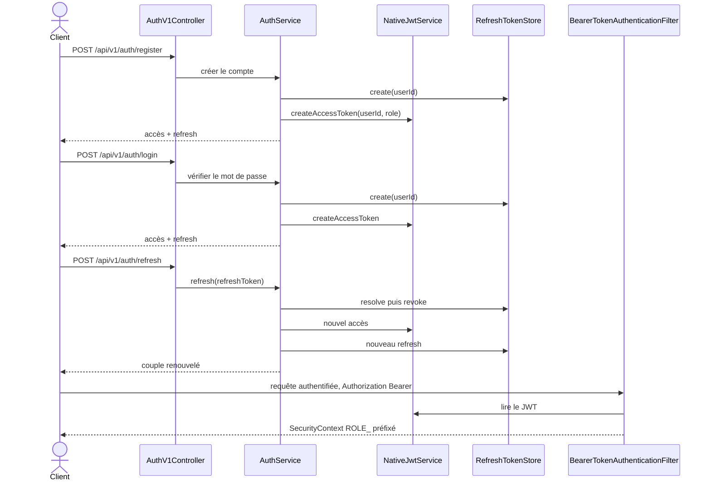
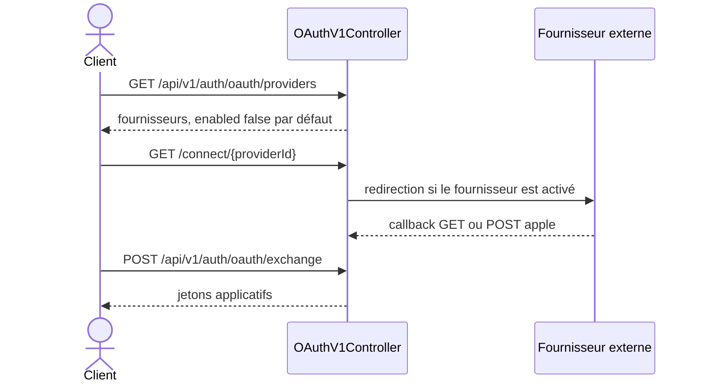

# 50 — Authentification

## Objectif

Cette fiche est une vue complémentaire de la série documentaire 41–60. Elle décrit le parcours d’authentification confirmé : inscription, connexion, rafraîchissement, jeton Bearer, et fournisseurs OAuth désactivés par défaut. Les classes centrales sont `NativeJwtService`, `AuthSessionEntity` et `AuthRefreshTokenEntity`.

## Statut

Élevé. Confirmé par le code.

## Sources analysées

- `AuthController` (`/api/auth`) et `AuthV1Controller` (`/api/v1/auth`)
- `OAuthV1Controller` (`/api/v1/auth/oauth`)
- `AuthService` (register, login, refresh, logout)
- `NativeJwtService`
- `AuthSessionEntity`, `AuthRefreshTokenEntity`, `OAuthIdentityEntity`
- `SecurityConfig` pour les routes `permitAll`
- `application.yaml` : TTL, `legacy-session-enabled: false`, fournisseurs OAuth `enabled: false` par défaut

Aucune valeur de `DARTCHAIN_JWT_SECRET` ni de secret client OAuth n’est recopiée. Un défaut est présent dans `application.yaml` pour la propriété du secret JWT ; il n’est pas cité.

## Éléments représentés

- Inscription et connexion sur les préfixes legacy et v1.
- Émission d’un accès JWT HS256 et d’un jeton de rafraîchissement.
- Filtre Bearer sur les routes qui ne sont pas en `permitAll`.
- Échange OAuth, présent dans le code et autorisé anonymement, avec fournisseurs éteints par défaut.
- Session table et drapeau `legacy-session-enabled: false`.

## Diagramme

Parcours OAuth, fournisseurs désactivés par défaut dans `application.yaml`.

## Explication

`AuthV1Controller` expose `POST /register`, `POST /login`, `POST /refresh`, `POST /logout` et `GET /me` sous `/api/v1/auth`. `AuthController` reprend register, login, logout et me sous `/api/auth`, sans route refresh sur ce préfixe legacy. `SecurityConfig` laisse passer sans authentification les POST register et login des deux préfixes, ainsi que `POST /api/v1/auth/refresh` et `POST /api/v1/auth/oauth/exchange`.

`AuthService`, après une inscription ou une connexion réussie, crée un jeton de rafraîchissement via `RefreshTokenStore.create` et un JWT via `NativeJwtService.createAccessToken(userId, role)`. Le service JWT est documenté dans son en-tête comme un HS256 natif du JDK, sans librairie tierce. La durée d’accès lue est 3600 secondes, celle de rafraîchissement 604800 secondes (`application.yaml`). Le rafraîchissement charge le compte par `authTokenResolver.resolveRefreshToken`, révoque le jeton présenté, écrit un audit `auth.refresh`, puis émet un nouveau couple. `logout` révoque le refresh lorsqu’il est fourni.

Le filtre `BearerTokenAuthenticationFilter` est ajouté devant `UsernamePasswordAuthenticationFilter`. L’autorité Spring est construite dans `AuthenticatedUser` sous la forme `ROLE_` + nom du rôle. Le mot de passe a une longueur minimale configurée de 6 caractères.

`legacy-session-enabled` vaut `false`. La table `auth_sessions` (`AuthSessionEntity`) existe pourtant, alimentée par `JpaSessionStore` ou `InMemorySessionStore` selon le mode. Cette fiche ne prétend pas que chaque login écrit encore une session legacy : le drapeau est faux, la table reste dans le schéma.

OAuth est un second canal. `OAuthV1Controller` publie la liste des fournisseurs, la connexion, le callback GET, le callback POST Apple, et l’échange de code. Les sept fournisseurs (google, meta, apple, microsoft, github, x, discord) ont `enabled` à false dans `application.yaml`, via des variables `OAUTH_*_ENABLED` dont le défaut lu est `false`. `application-postgres.yaml` met seulement `dev-mock-enabled` à true par défaut de cette variable. Les secrets clients ne sont pas des valeurs dans cette fiche : les variables sont vides par défaut dans le YAML lu. L’identité persistée, lorsque le flux aboutit, est `OAuthIdentityEntity` (`userId`, `provider`, `providerSubject`).

Le déverrouillage du panneau admin par seed n’est pas une connexion JWT. Il est traité dans la fiche 53.

## Correspondance avec le code

| Étape | Méthode ou type |
| --- | --- |
| Inscription v1 | `AuthV1Controller.register` |
| Connexion v1 | `AuthV1Controller.login` |
| Rafraîchissement | `AuthService.refresh` |
| JWT | `NativeJwtService.createAccessToken` |
| Refresh persisté | `AuthRefreshTokenEntity` / `RefreshTokenStore` |
| Session table | `AuthSessionEntity` |
| Bearer | `BearerTokenAuthenticationFilter` |
| Préfixe de rôle | `AuthenticatedUser`, `ROLE_` + `UserRole.name()` |
| OAuth | `OAuthV1Controller`, `OAuthService` |
| Audit refresh | `AuthAuditService.refresh` → action `auth.refresh` |

Les routes `GET /me` ne sont pas dans la liste `permitAll` dédiée. Elles tombent sous `GET /**` qui est `permitAll` dans `SecurityConfig`. Le contrôleur peut donc être atteint sans authentification Spring ; le comportement métier de `me` sans jeton n’est pas redessiné au-delà de ce constat de filtre.

## Hypothèses

- Le couple access + refresh renvoyé au client est celui construit dans `AuthService` autour de `refreshTokenStore.create` et du JWT. Le DTO exact de la réponse n’est pas recopié champ par champ.
- Le mock OAuth du profil postgres (`OAUTH_DEV_MOCK_ENABLED` défaut true dans `application-postgres.yaml`) ne remplace pas le défaut `false` des fournisseurs du fichier de base lorsque les deux fichiers sont fusionnés : l’ordre de profil Spring peut surcharger. Cette fiche constate les deux défauts écrits, sans trancher un ordre non exécuté.

## Anomalies détectées

- Double surface `/api/auth` et `/api/v1/auth`, la seconde seule portant `/refresh`.
- Sessions legacy désactivées par drapeau alors que la table `auth_sessions` est migrée et mappée.
- OAuth `permitAll` alors que les fournisseurs sont désactivés : la surface HTTP existe avant l’activation.
- `GET /**` permitAll rend les lectures d’auth accessibles au filtre anonyme, l’autorisation fine étant portée par le corps des méthodes.
- Longueur minimale de mot de passe égale à 6.

## Recommandations

- Garder `NativeJwtService` comme seul émetteur d’accès et faire échouer le démarrage hors profil démo si le secret JWT est encore le défaut de `application.yaml`.
- Lorsque les fournisseurs restent désactivés, répondre explicitement « fournisseur éteint » plutôt que d’ouvrir le callback.
- Décider du sort de `AuthSessionEntity` : table encore utile, ou reliquat du drapeau `legacy-session-enabled: false`.
