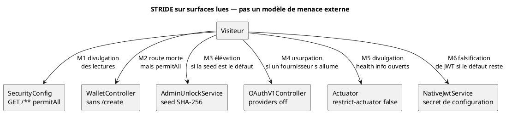

# 52 — Menaces

## Objectif

Cette fiche est une vue complémentaire de la série documentaire 41–60. Elle applique STRIDE uniquement à des surfaces lues dans le dépôt : lectures GET publiques, route wallet create sans contrôleur, seed d’administration, OAuth, actuator non restreint par défaut, secret JWT en configuration. Chaque menace cite un fichier. Aucune CVE n’est inventée.

## Statut

Moyen. Déduit : STRIDE est une grille d’analyse posée sur des faits de code, pas un test d’intrusion exécuté.

## Sources analysées

- `SecurityConfig.java`
- `WalletController.java`
- `application.yaml` (propriétés seulement ; défauts présents, valeurs non recopiées)
- `AdminUnlockService.java`
- `OAuthV1Controller.java`
- `NativeJwtService.java`
- `application-prod.yaml` et `application-staging.yaml` pour le contraste actuator
- `UserRole.java` (la seed n’est pas un rôle)

## Éléments représentés

Six surfaces, une ligne STRIDE dominante chacune, le fichier qui la prouve, et ce qui n’a pas été observé (pas d’avis de vulnérabilité publique inventé).

| Id | Surface | Catégorie STRIDE retenue | Fichier |
| --- | --- | --- | --- |
| M1 | `GET /**` permitAll | Information disclosure | `SecurityConfig.java` |
| M2 | `POST /api/wallets/create` autorisé, méthode absente | Spoofing de contrat d’API | `SecurityConfig.java`, `WalletController.java` |
| M3 | Déverrouillage admin par seed, distinct du JWT | Elevation of privilege | `AdminUnlockService.java`, `application.yaml` |
| M4 | OAuth permitAll, fournisseurs désactivés par défaut | Spoofing si activation | `OAuthV1Controller.java`, `application.yaml` |
| M5 | `restrict-actuator: false` dans le fichier de base | Information disclosure | `application.yaml` |
| M6 | Secret JWT fourni par la configuration, avec un défaut | Spoofing / tampering des jetons | `application.yaml`, `NativeJwtService.java` |

## Diagramme

## Explication

**M1 — Divulgation d’information.** `SecurityConfig` termine les correspondances de lecture par `requestMatchers(HttpMethod.GET, "/**").permitAll()` avant `.anyRequest().authenticated()`. Un client sans jeton peut invoquer tout GET atteint par Spring, sous réserve de ce que la méthode elle-même vérifie. Ce n’est pas une faille numérotée : c’est la règle écrite. Les écritures hors liste blanche restent authentifiées. La menace est de traiter une donnée de compte, d’explorateur ou d’admin en lecture comme protégée alors que le filtre ne le fait pas.

**M2 — Usurpation du contrat d’API.** Le même fichier autorise `POST /api/wallets/create`. `WalletController` ne déclare que `/create-client` et `/verify`. La route autorisée ne mappe aucun contrôleur. Un client qui suit l’ancienne documentation croit créer un portefeuille serveur. Le drapeau `allow-server-wallet-create` est `false` dans `application.yaml`. La menace est un écart entre la politique HTTP et le code : surface annoncée, comportement absent. Ce n’est pas, en soi, une création de clé.

**M3 — Élévation de privilège.** `POST /api/v1/admin/unlock` est `permitAll`. `AdminUnlockService` compare une empreinte SHA-256 de la phrase normalisée à la propriété `dartchain.admin.seed-sha256`, alimentée par `DARTCHAIN_ADMIN_SEED_SHA256`. Un défaut est présent dans `application.yaml` ; la valeur n’est pas recopiée. Le succès produit un jeton d’unlock en mémoire, pas un JWT `ROLE_ADMIN`. La menace est l’usage de ce défaut hors poste de développement : quiconque connaît le défaut documenté dans le fichier peut déverrouiller le panneau sans être administrateur au sens de `UserRole`.

**M4 — Usurpation via OAuth.** Les GET `/api/v1/auth/oauth/**`, le POST d’échange et le callback Apple sont `permitAll`. Les fournisseurs sont désactivés par défaut (`OAUTH_*_ENABLED` à false). La menace n’est pas un fournisseur déjà compromis dans le dépôt : aucun provisionnement réel n’a été identifié. Elle apparaît si un opérateur active un fournisseur sans secret dédié, ou si le mock du profil postgres (`dev-mock-enabled`) est laissé allumé. Le fichier qui ouvre la surface est `OAuthV1Controller` ; le fichier qui éteint les fournisseurs est `application.yaml`.

**M5 — Divulgation actuator.** `application.yaml` fixe `dartchain.ops.restrict-actuator: false` et expose `health,info` avec un accès health non restreint dans le bloc `management`. Staging et prod passent `restrict-actuator` à `true`. La menace concerne le défaut, pas ces profils : sondes et info applicative (mode de persistance, version) sont lisibles. Aucune alerte externe n’est associée. Le profil staging ajoute le nom d’endpoint `prometheus` dans l’exposition actuator ; aucun produit Prometheus ou Grafana déployé n’a été identifié, et aucune CVE sur cet endpoint n’est citée.

**M6 — Falsification de jeton.** `NativeJwtService` signe les accès en HS256 avec le secret porté par `AuthProperties` / `dartchain.auth.jwt-secret`. La propriété est `${DARTCHAIN_JWT_SECRET:...}` et un défaut de développement est présent dans `application.yaml`. Il n’est pas recopié. `application-prod.yaml` exige la variable sans défaut dans le fragment lu (`${DARTCHAIN_JWT_SECRET:}`). La menace est l’emploi du défaut : un tiers qui le connaît peut fabriquer un accès accepté par le filtre Bearer. Ce n’est pas une vulnérabilité publiée ; c’est le comportement d’un HMAC dont le secret est dans le fichier de configuration de démo.

Menaces écartées de cette fiche parce qu’elles ne reposent pas sur une surface relue : injection dans un contrat Solidity (aucun `.sol`), vol d’un mainnet (le README décrit une démo), CVE précises sur Spring ou sur l’image Postgres.

## Correspondance avec le code

| Menace | Preuve |
| --- | --- |
| M1 | `SecurityConfig` lignes de `authorizeHttpRequests`, matcher GET `/**` |
| M2 | Même classe, matcher POST `/api/wallets/create` ; `WalletController` mappings `/create-client` et `/verify` seulement |
| M3 | `AdminUnlockService.unlock`, propriété `dartchain.admin.seed-sha256` |
| M4 | Matchers OAuth de `SecurityConfig` ; clés `oauth.*.enabled` de `application.yaml` |
| M5 | `dartchain.ops.restrict-actuator` et bloc `management.endpoints.web.exposure` |
| M6 | `NativeJwtService` en-tête HS256 ; clé `dartchain.auth.jwt-secret` |

`RateLimitFilter` (60 / 60000 ms) réduit le déni de service applicatif mais n’est pas modélisé comme une menace propre : c’est un contrôle. Le déni de service résiduel n’est pas chiffré ici.

## Hypothèses

- « Connaître le défaut » suppose que le fichier `application.yaml` est lisible par l’attaquant (dépôt ou image). Cette fiche ne vérifie pas si l’image Docker publiée embarque ce YAML tel quel.
- Le jeton d’unlock admin est en mémoire de processus (`tokens` dans `AdminUnlockService`). Un redémarrage l’efface. L’élévation dure au plus le TTL configuré (`unlock-ttl-seconds`), dont le nom de variable est `DARTCHAIN_ADMIN_UNLOCK_TTL`. La valeur par défaut numérique 3600 est celle de la propriété de durée, pas un secret.

## Anomalies détectées

- La politique HTTP annonce une création de portefeuille que le contrôleur n’implémente pas.
- Le défaut de seed et le défaut de JWT vivent dans le même fichier que la configuration de démo, sans garde qui les interdirait dès que `commercial` passe à true. Les profils prod retirent le défaut JWT dans le fragment lu ; le fichier de base le conserve.
- OAuth est joignable avant d’être configuré.
- Aucune CVE n’est associée : l’absence de numéro n’est pas une preuve d’innocuité, c’est le respect du périmètre.

## Recommandations

- Lier M3 et M6 à l’échec de démarrage si les propriétés portent encore leur défaut dès que le profil n’est pas la démo mémoire.
- Fermer M2 en retirant le matcher ou en réimplémentant la route derrière `allow-server-wallet-create`.
- Réduire M1 en listant les GET publics au lieu de `/**`.
- Avant d’activer un fournisseur OAuth, exiger le secret correspondant et couper `dev-mock-enabled` (M4).
- Déployer avec le YAML staging ou prod pour M5, et ne pas exposer l’endpoint nommé `prometheus` sans un contrôle d’accès si cet identifiant reste dans `application-staging.yaml`.
