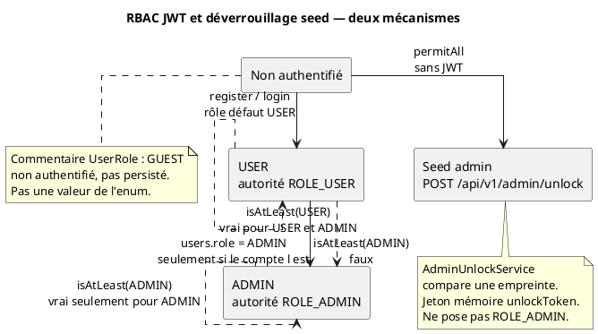

# 53 — Contrôle d’accès par rôles

## Objectif

Cette fiche est une vue complémentaire de la série documentaire 41–60. Elle décrit le RBAC applicatif confirmé : les rôles `USER` et `ADMIN`, la méthode `isAtLeast`, le préfixe d’autorité `ROLE_`, et la séparation entre ce rôle JWT et le déverrouillage par seed du panneau d’administration.

## Statut

Élevé. Confirmé par le code.

## Sources analysées

- `io.dartchain.backend.auth.model.UserRole`
- `AuthenticatedUser`
- `RoleAuthorizationService`
- `UserEntity.role` et migration V11 (`role VARCHAR(16) NOT NULL DEFAULT 'USER'`)
- `AdminUnlockService` et `SecurityConfig` (`POST /api/v1/admin/unlock` permitAll)
- `application.yaml` : `dartchain.admin.seed-sha256` (défaut présent, valeur non recopiée)

## Éléments représentés

- Enum à deux valeurs persistables : `USER`, `ADMIN`.
- Commentaire `GUEST` : visiteur non authentifié, non persisté, pas une valeur d’enum.
- Autorité Spring `ROLE_USER` ou `ROLE_ADMIN`.
- Comparaison `isAtLeast`.
- Seed d’unlock : jeton séparé, propriété `DARTCHAIN_ADMIN_SEED_SHA256`, qui ne modifie pas `users.role`.

## Diagramme

## Explication

`UserRole` déclare `USER` et `ADMIN`. Le commentaire de classe indique que GUEST désigne le visiteur non authentifié et qu’il n’est pas persisté. `fromValue` renvoie `USER` si la chaîne est vide ou inconnue. La colonne `users.role` est une `String` ; l’entité initialise le champ Java à `"USER"`, et V11 pose le défaut SQL `'USER'`.

`isAtLeast` se lit ainsi : si le rôle exigé est `USER`, alors `USER` et `ADMIN` passent ; si le rôle exigé est `ADMIN`, seul `ADMIN` passe. Il n’y a pas d’échelle plus fine.

`AuthenticatedUser` fabrique une autorité `ROLE_` + `role.name()`. Un compte `ADMIN` obtient donc `ROLE_ADMIN`. Ce préfixe est celui attendu par les expressions Spring habituelles ; la chaîne de filtres, elle, s’appuie d’abord sur `authenticated` versus `permitAll`, puis les services rappellent `RoleAuthorizationService`.

`RoleAuthorizationService` consulte `account.getRole().isAtLeast(UserRole.USER)` pour des mutations. Le minage (`BlockchainController`) passe par `authorizeMutation` avec l’action `blockchain.mine`, puis `AuthService.ensureWalletOwnership` vérifie que l’adresse du mineur appartient au compte. Le rôle ADMIN n’est pas requis par cet appel précis : la barre lue est l’authentification de mutation et la propriété du portefeuille.

Le panneau admin ne s’ouvre pas en présentant `ROLE_ADMIN`. `AdminUnlockService.unlock` normalise une phrase, la compare à l’empreinte configurée, et mémorise un `unlockToken` avec une expiration. `requireUnlock` refuse si le jeton manque ou est expiré. `lock` retire le jeton. Rien de ce flux n’écrit `users.role`. `SecurityConfig` laisse l’unlock anonyme. La seed et le rôle JWT sont donc deux portes. Un visiteur peut déverrouiller l’UI admin sans être `ADMIN`, et un compte `ADMIN` ne déverrouille pas le panneau par son seul JWT si le service exige le jeton de seed.

`POST /api/v1/admin/unlock` est permitAll. Les autres opérations d’admin sous le même contrôleur ne sont pas toutes détaillées ici ; le statut et le verrou existent (`status`, `unlock`, `lock`, `export` sur `AdminV1Controller`).

## Correspondance avec le code

| Concept | Ancrage |
| --- | --- |
| Valeurs | `enum UserRole { USER, ADMIN }` |
| Ordre | `UserRole.isAtLeast` |
| Préfixe | `"ROLE_" + role.name()` dans `AuthenticatedUser` |
| Défaut persisté | `UserEntity.role = "USER"` et V11 `DEFAULT 'USER'` |
| Mutation minage | `RoleAuthorizationService.authorizeMutation`, action `blockchain.mine` |
| Seed | `AdminUnlockService`, propriété `dartchain.admin.seed-sha256` |
| Porte HTTP de la seed | `SecurityConfig`, POST `/api/v1/admin/unlock` |

Le seuil d’alerte `rbac-denied-alert-threshold` (défaut 20 dans `application.yaml`) compte des refus pour l’observabilité. Il ne crée pas un troisième rôle.

## Hypothèses

- Un compte reçoit `ADMIN` seulement si une écriture met cette chaîne dans `users.role` (amorçage ou outil). Le nom de propriété `bootstrap-admin-username` existe. Le mécanisme complet d’amorçage n’est pas redessiné, et aucun mot de passe n’est cité.
- `fromValue` qui retombe sur `USER` pour une valeur inconnue est un durcissement lu dans la méthode. Il peut aussi masquer une donnée corrompue en accordant le rôle le plus bas plutôt qu’en rejetant la ligne.

## Anomalies détectées

- Deux systèmes d’autorité coexistent : le rôle JWT et la seed. Les confondre dans une revue laisserait croire qu’un `ROLE_ADMIN` ouvre le panneau, ou qu’un unlock fait de l’appelant un administrateur de base.
- GUEST est documenté dans un commentaire et absent de l’enum. Un filtre ou un client qui enverrait le rôle `GUEST` serait relu comme `USER` par `fromValue` (valeur inconnue → `USER`), ce qui est l’inverse de l’intention du commentaire.
- `GET /**` permitAll (fiche 51) court-circuite le RBAC Spring sur les lectures. Le rôle ne filtre pas ces GET au niveau de la chaîne.

## Recommandations

- Nommer les deux portes dans l’interface d’administration : « rôle de compte » et « déverrouillage seed ».
- Faire rejeter `fromValue` sur une valeur inconnue au lieu de la convertir en `USER`, si le commentaire GUEST doit rester « pas un rôle ».
- Exiger à la fois `ROLE_ADMIN` et le jeton de seed pour les exports, si le produit veut que la seed ne suffise pas à elle seule. Aujourd’hui le code d’unlock ne pose pas cette conjonction.
