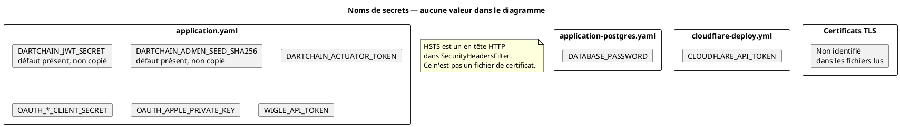

# 54 — Secrets et certificats

## Objectif

Cette fiche est une vue complémentaire de la série documentaire 41–60. Elle inventorie des noms de variables vus dans la configuration et les workflows. Elle ne contient aucune valeur. Un défaut est présent dans `application.yaml` pour le secret JWT et pour l’empreinte de seed admin ; ces défauts ne sont pas recopiés.

## Statut

Moyen. Noms confirmés par lecture des fichiers. Les valeurs sont hors périmètre. Aucun matériel de certificat de production n’a été identifié dans les fichiers lus.

## Sources analysées

- `apps/dartchain-backend/src/main/resources/application.yaml`
- `application-postgres.yaml`, `application-prod.yaml`, `application-staging.yaml`
- `.github/workflows/cloudflare-deploy.yml`
- `docker-compose.yml` (noms d’environnement, pas les valeurs)
- `SecurityHeadersFilter` (HSTS, qui n’est pas un certificat)

Toute chaîne secrète rencontrée pendant la lecture a été écartée et remplacée, si une place devait être tenue, par `[SECRET MASQUÉ]`. Aucune place de valeur n’est tenue dans les tableaux ci-dessous.

## Éléments représentés

Noms seulement :

| Nom | Où le nom apparaît | Rôle indiqué par la clé, sans valeur |
| --- | --- | --- |
| `DARTCHAIN_JWT_SECRET` | `application.yaml`, `application-prod.yaml` | Secret HMAC du JWT |
| `DARTCHAIN_ADMIN_SEED_SHA256` | `application.yaml` | Empreinte de la seed d’unlock admin |
| `DARTCHAIN_ACTUATOR_TOKEN` | `application.yaml`, profils staging et prod | Jeton d’accès actuator lorsque la restriction est active |
| `DATABASE_PASSWORD` | `application-postgres.yaml` | Mot de passe JDBC |
| `OAUTH_GOOGLE_CLIENT_SECRET` | bloc `oauth.google` | Secret client Google |
| `OAUTH_META_CLIENT_SECRET` | bloc `oauth.meta` | Secret client Meta |
| `OAUTH_MICROSOFT_CLIENT_SECRET` | bloc `oauth.microsoft` | Secret client Microsoft |
| `OAUTH_GITHUB_CLIENT_SECRET` | bloc `oauth.github` | Secret client GitHub |
| `OAUTH_X_CLIENT_SECRET` | bloc `oauth.x` | Secret client X |
| `OAUTH_DISCORD_CLIENT_SECRET` | bloc `oauth.discord` | Secret client Discord |
| `OAUTH_APPLE_PRIVATE_KEY` | bloc `oauth.apple` | Clé privée Apple, distincte d’un client secret |
| `WIGLE_API_TOKEN` | bloc `dartchain.wigle` | Jeton WiGLE |
| `CLOUDFLARE_API_TOKEN` | `cloudflare-deploy.yml` | Jeton d’API du déploiement manuel |

Le nom `CLOUDFLARE_ACCOUNT_ID` apparaît aussi dans ce workflow, comme secret GitHub. Il est cité parce qu’il est lu à côté de `CLOUDFLARE_API_TOKEN`. Sa valeur n’est pas dans le dépôt.

## Diagramme

## Explication

`application.yaml` lie `dartchain.auth.jwt-secret` à `DARTCHAIN_JWT_SECRET` et fournit un défaut de développement. Ce défaut est présent. Il n’est pas recopié. La même phrase vaut pour `dartchain.admin.seed-sha256` et `DARTCHAIN_ADMIN_SEED_SHA256` : un défaut est présent dans `application.yaml`, la valeur est `[SECRET MASQUÉ]` et n’apparaît pas ici.

`application-prod.yaml` relie le secret JWT à la même variable avec une substitution vide dans le fragment lu, donc sans le défaut du fichier de base si le profil prod écrase la clé. `DARTCHAIN_ACTUATOR_TOKEN` est substitué sans valeur par défaut dans les trois fichiers (chaîne vide après la variable). `restrict-actuator` reste `false` dans le fichier de base et passe à `true` en staging et en prod. Le nom du jeton existe même lorsque la restriction est éteinte.

`DATABASE_PASSWORD` est le nom JDBC dans `application-postgres.yaml`. Un défaut local y est présent ; il n’est pas recopié. Compose, pour le service `postgres` du profil `default`, exige `POSTGRES_PASSWORD` et indique de générer les secrets plutôt que de les figer. Le mot de passe n’est pas dans cette fiche. Les profils Compose autres que ce fragment peuvent avoir un défaut ; il n’est pas cité.

Les secrets OAuth suivent le motif `OAUTH_<FOURNISSEUR>_CLIENT_SECRET` pour google, meta, microsoft, github, x et discord. Apple n’utilise pas ce motif pour la clé : le nom lu est `OAUTH_APPLE_PRIVATE_KEY`, aux côtés de `OAUTH_APPLE_CLIENT_ID`, `OAUTH_APPLE_TEAM_ID` et `OAUTH_APPLE_KEY_ID` qui sont des identifiants, pas la clé. Tous les `enabled` de fournisseurs sont faux par défaut. Les substitutions de secrets clients sont vides dans le YAML de base. Aucun secret OAuth réel n’est dans le dépôt au sens de ces fichiers : le provisionnement hors dépôt est non identifié.

`WIGLE_API_TOKEN` alimente `dartchain.wigle.api-token`. `dartchain.wigle.mock-enabled` vaut `true` par défaut, donc l’appel réel peut rester éteint. Le jeton n’est pas recopié.

`CLOUDFLARE_API_TOKEN` est lu par le job manuel `workflow_dispatch` via `${{ secrets.CLOUDFLARE_API_TOKEN }}`. Il ne transite pas par `application.yaml`.

Certificats : les fichiers de configuration lus ne déclarent pas de chemin `.pem`, `.crt` ou keystore. `SecurityHeadersFilter` peut envoyer `Strict-Transport-Security` sur une requête déjà HTTPS. Cloudflare Pages et Render, décrits par les workflows et `deploy/render.yaml`, sont les terminaisons TLS attendues hors processus Java. Aucun certificat n’a été extrait ni décrit. Cette absence dans les fichiers lus n’est pas une preuve qu’aucun certificat n’existe sur les comptes Cloudflare ou Render.

Autres noms vus et non développés, parce qu’ils sortent de la liste demandée ou portent un défaut qu’il ne faut pas copier : `DARTCHAIN_BOOTSTRAP_ADMIN`, `DARTCHAIN_BOOTSTRAP_ADMIN_PASSWORD`, `M4T3R_REWARD_SIGNING_KEY`, `POSTGRES_PASSWORD`. Ils existent comme noms. Leurs valeurs ne sont pas dans cette fiche.

## Correspondance avec le code

| Consommateur | Nom |
| --- | --- |
| `NativeJwtService` via `AuthProperties` | `DARTCHAIN_JWT_SECRET` |
| `AdminUnlockService` | `DARTCHAIN_ADMIN_SEED_SHA256` |
| Filtre actuator / `dartchain.ops.actuator-token` | `DARTCHAIN_ACTUATOR_TOKEN` |
| Datasource Spring du profil postgres | `DATABASE_PASSWORD` |
| `OAuth` configuration properties | `OAUTH_*_CLIENT_SECRET`, `OAUTH_APPLE_PRIVATE_KEY` |
| `Wigle` configuration | `WIGLE_API_TOKEN` |
| `scripts/cloudflare-deploy.sh` appelé par le workflow | `CLOUDFLARE_API_TOKEN` |

## Hypothèses

- Une substitution `${VAR:}` vide signifie « pas de défaut dans ce fichier », pas « la variable est définie dans l’environnement de production ». L’environnement Render réel n’a pas été interrogé.
- Le commentaire YAML qui renvoie vers un fichier local de seed n’est pas ouvert ici. Le chemin n’est pas une valeur de secret et le fichier n’est pas cité avec son contenu.

## Anomalies détectées

- Un défaut de `DARTCHAIN_JWT_SECRET` et un défaut de `DARTCHAIN_ADMIN_SEED_SHA256` sont présents dans `application.yaml`. Les publier dans l’image ou le dépôt les rend connus de quiconque lit le fichier.
- `DATABASE_PASSWORD` a aussi un défaut dans `application-postgres.yaml`. Le profil Compose `default` refuse au contraire de démarrer sans `POSTGRES_PASSWORD`. Les deux politiques divergent.
- Apple est le seul fournisseur dont le secret porte un nom de clé privée plutôt que de client secret. Le traiter comme les autres `CLIENT_SECRET` dans un gestionnaire de secrets serait une erreur de nom.
- Aucun certificat n’accompagne l’en-tête HSTS. La sécurité de transport est déléguée à l’hébergeur, sans artefact dans le dépôt.

## Recommandations

- Retirer les défauts de `application.yaml` pour `DARTCHAIN_JWT_SECRET` et `DARTCHAIN_ADMIN_SEED_SHA256`, sur le modèle du fragment prod qui n’en met pas pour le JWT.
- Stocker les noms de cette fiche dans le gestionnaire de l’environnement (Render, GitHub Actions) et garder le dépôt sans valeur.
- Ne pas committer de clé Apple ni de jeton Cloudflare. Le workflow lit déjà le magasin `secrets` de GitHub pour `CLOUDFLARE_API_TOKEN`.
- Documenter la terminaison TLS (Pages, Render) comme responsabilité d’hébergement, sans ajouter de certificat fictif au schéma applicatif.
