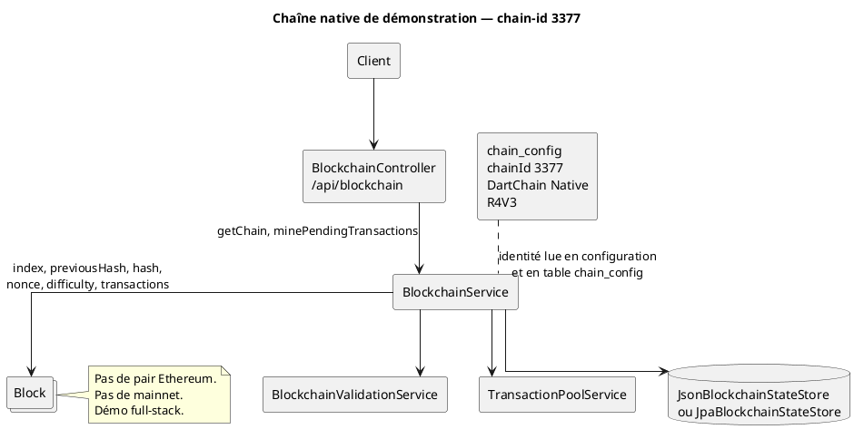
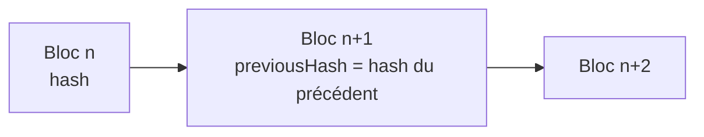

# 55 — Blockchain

## Objectif

Cette fiche est une vue complémentaire de la série documentaire 41–60. Elle décrit la chaîne native de démonstration, pas un réseau Ethereum et pas un mainnet. Les objets centraux sont `Block`, `BlockchainService` et les stores JSON ou JPA. Le chain-id confirmé est 3377.

## Statut

Élevé. Confirmé par le code.

## Sources analysées

- `io.dartchain.backend.blockchain.model.Block`
- `io.dartchain.backend.blockchain.application.BlockchainService`
- `JsonBlockchainStateStore`, `JpaBlockchainStateStore`
- `BlockEntity`, migration `V6__blockchain.sql`
- `ChainProperties` et `application.yaml` (`dartchain.chain`)
- Insert `chain_config` de `V12__ad_persistence.sql`
- `README.md` : « Ce n’est pas une crypto réelle. Aucun mainnet »

Aucun fichier `.sol` n’entre dans cette fiche. Le personnage servi par `CharacterNftController` n’est pas un objet de cette chaîne (fiche 58).

## Éléments représentés

- Bloc : index, horodatage, donnée, transactions, hash précédent, hash, nonce, difficulté.
- Service de chaîne : lecture, validation, minage des transactions en attente.
- Persistance double : snapshot JSON ou tables `blocks` et `pending_transactions`.
- Identité réseau : chain-id 3377, jeton R4V3, nom YAML « DartChain Native ».
- Absence de connexion à un réseau public Ethereum.

## Diagramme

Enchaînement des blocs, tel que les champs le permettent.

## Explication

`Block` porte `index`, `timestamp`, `data`, `transactions` (`List<Transaction>`), `previousHash`, `hash`, `nonce` et `difficulty`. Des constructeurs conservent l’ancienne forme « une chaîne `data` » et la forme « une liste de transactions ». La difficulté par défaut des anciens constructeurs est 0. La table `blocks` reprend ces informations : `block_index` en clé, hashes, nonce, difficulté, et `transactions_json` pour la liste. `V6__blockchain.sql` ne référence aucune autre table.

`BlockchainService` expose notamment la lecture de chaîne, le dernier bloc, les statistiques, la validité, le solde, le minage d’un bloc de données (`mineBlock`) et le minage du mempool (`minePendingTransactions`). La méthode privée `mine` travaille un `Block`. Le contrôleur HTTP `BlockchainController` sous `/api/blockchain` publie solde, chaîne, blocs, dernier bloc, statistiques, validité, pending, et deux POST de minage (`/mine` et `/mine/{minerAddress}`). Ces POST exigent une autorisation de mutation et la propriété du portefeuille (fiche 53). Il existe aussi `BlockchainV1Controller` sous `/api/v1/blockchain`.

Le store actif dépend de `dartchain.persistence.mode`. `JsonBlockchainStateStore` si `memory` (défaut). `JpaBlockchainStateStore` si `postgres`, qui s’appuie sur `BlockEntity` et `PendingTransactionEntity`. Le snapshot de chaîne est le type `BlockchainSnapshot` cité par l’exploration du paquet de persistance.

L’identité réseau est fixée à deux endroits qui concordent sur l’identifiant et le jeton :

- `application.yaml` : `chain-id: 3377`, `network-name: DartChain Native`, `native-token: R4V3`.
- `chain_config` après V12 : `chainId` = 3377, `networkName` = DartChain Native, `nativeToken` = R4V3, `addressSchemeDefault` = evm-compatible, `signingPayloadVersion` = DCv1.

`ChainProperties` déclare les mêmes défauts Java `chainId = 3377` et `nativeToken = R4V3`, mais `networkName = "R4V3 Testnet"` si le YAML ne charge pas la propriété. Le produit reste une démo : le README refuse le qualificatif de crypto réelle et de mainnet. Les drapeaux M4T3R lus (`mainnet-enabled` défaut false, `testnet-enabled` défaut false, settlement `OFFCHAIN`) vont dans le même sens et ne branchent pas cette chaîne sur un réseau public.

Le micro-jeton M4T3R et le jeton R4V3 sont des unités du produit. Ils circulent dans cette chaîne native et dans les services de récompense, pas via un client Ethereum.

## Correspondance avec le code

| Élément | Type |
| --- | --- |
| Bloc | `io.dartchain.backend.blockchain.model.Block` |
| Service | `BlockchainService` |
| Validation | `BlockchainValidationService` |
| Mempool | `TransactionPoolService`, `PendingTransactionService` |
| Store JSON | `JsonBlockchainStateStore` |
| Store JPA | `JpaBlockchainStateStore` |
| Ligne SQL | `BlockEntity` / table `blocks` |
| Propriétés | `ChainProperties`, préfixe `dartchain.chain` |
| Config persistée | `ChainConfigEntity` |

Le health et le snapshot live relisent cette chaîne (`LiveUpdateBroadcastService` envoie blocs, pending et stats). Ce canal est un WebSocket applicatif, pas un log Ethereum (fiche 59).

## Hypothèses

- « Pas de mainnet » s’appuie sur le README et sur `mainnet-enabled` faux par défaut. Aucun nœud distant n’a été contacté pour le vérifier.
- Le schéma d’adresse `evm-compatible` dans `chain_config` décrit un format d’adresse, pas un déploiement sur Ethereum. Les fiches 56 et 58 tiennent la même ligne.

## Anomalies détectées

- `ChainProperties.networkName` vaut « R4V3 Testnet » dans le Java, « DartChain Native » dans le YAML et dans `chain_config`.
- Deux représentations du bloc coexistent : champs objet et colonne `transactions_json`.
- `block_data` peut être nul en SQL alors que les hashes sont obligatoires. Les anciens constructeurs mettent `data` et laissent `transactions` vide, ou l’inverse.
- Aucun smart contract n’accompagne cette chaîne. Un contrôleur nommé NFT ne doit pas être lu comme un contrat (fiche 58).

## Recommandations

- Afficher un seul nom de réseau, celui du YAML, y compris lorsque les propriétés Java servent de repli.
- Conserver le chain-id 3377 dans `ChainProperties`, `application.yaml` et `chain_config` lors de tout changement : trois sources aujourd’hui.
- Dans la documentation publique, répéter que la chaîne est native et de démonstration, pour qu’un schéma d’adresse « evm-compatible » ne soit pas pris pour un réseau Ethereum.
