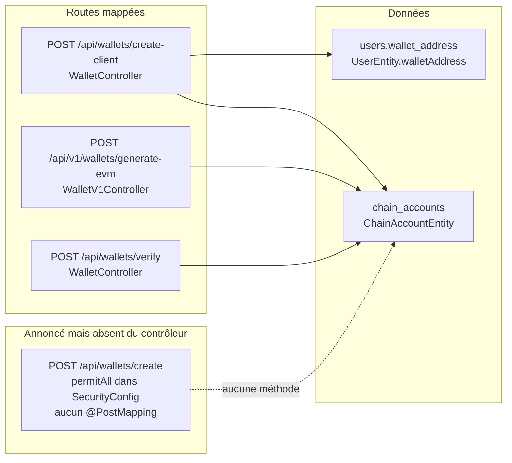

# 56 — Portefeuilles et comptes

## Objectif

Cette fiche est une vue complémentaire de la série documentaire 41–60. Elle décrit les portefeuilles de la chaîne native de démonstration, pas des comptes Ethereum. Les pièces lues sont `WalletController`, `WalletV1Controller`, `ChainAccountEntity` et `UserEntity.walletAddress`. La route `POST /api/wallets/create` est absente du contrôleur.

## Statut

Élevé. Confirmé par le code.

## Sources analysées

- `io.dartchain.backend.wallet.infrastructure.web.WalletController`
- `WalletV1Controller`
- `ChainAccountEntity`, migration V12 `chain_accounts`
- `UserEntity.walletAddress`
- `SecurityConfig` (matchers wallets)
- `application.yaml` : `allow-server-wallet-create: false`, `allow-server-evm-wallet-create: true`
- `ChainProperties.allowServerEvmWalletCreate`

## Éléments représentés

- `POST /api/wallets/create-client` : enregistrement d’un portefeuille créé côté client.
- `POST /api/wallets/verify` : vérification.
- `POST /api/v1/wallets/generate-evm` : génération EVM côté serveur, autorisée par le défaut de configuration.
- Compte de chaîne `chain_accounts` (adresse, schéma, clé publique, nonce).
- Adresse optionnelle sur l’utilisateur applicatif.
- Trou : `POST /api/wallets/create` permitAll sans mapping.

## Diagramme

Les flèches vers les tables indiquent les objets que ces routes concernent. Elles ne sont pas des clés étrangères SQL : `users.wallet_address` et `chain_accounts.address` ne sont pas liées par `REFERENCES`.

## Explication

`WalletController` est mappé sur `/api/wallets`. Les seules méthodes lues sont `@PostMapping("/create-client")` et `@PostMapping("/verify")`. Il n’y a pas de `@PostMapping("/create")` ni d’autre verbe sur ce contrôleur. `SecurityConfig` autorise pourtant, sans authentification, `POST /api/wallets/create` en même temps que `/verify` et `/create-client`. La politique HTTP et le contrôleur divergent. Le drapeau produit `allow-server-wallet-create` est `false` : même l’intention de configuration ferme la création serveur « historique ». La route reste dans le filtre.

`WalletV1Controller`, préfixe `ApiRoutes.WALLETS_V1_PREFIX` donc `/api/v1/wallets`, expose `@PostMapping("/generate-evm")`. `SecurityConfig` le laisse en `permitAll`. `ChainProperties` et `application.yaml` mettent `allow-server-evm-wallet-create` à `true`. Le profil `application-prod.yaml` le passe à `false`. La génération EVM de cette démo est donc un comportement de configuration, pas une connexion à un réseau Ethereum. Le chain-id reste 3377 (fiche 55). Le schéma stocké par défaut dans `chain_accounts` est `evm` (`address_scheme` VARCHAR(16) DEFAULT `evm` dans V12), et `chain_config` parle de `addressSchemeDefault` = `evm-compatible`.

`ChainAccountEntity` identifie le compte par `address` (VARCHAR 42), avec `addressScheme`, `publicKey`, `nonce` et `createdAt`. C’est le compte de la chaîne native.

`UserEntity.walletAddress` (VARCHAR 128, nullable en SQL) et `walletPublicKey` rangent une adresse sur le compte applicatif. Rien dans V1 ou V12 ne fait de cette colonne une clé étrangère vers `chain_accounts`. Les largeurs diffèrent (128 contre 42). Un utilisateur peut ne pas avoir d’adresse. Le minage vérifie par ailleurs que l’adresse demandée appartient au compte authentifié (`AuthService.ensureWalletOwnership`), ce qui relie les deux notions dans le service, pas dans le schéma.

`POST /api/wallets/verify` contrôle une preuve ou une adresse présentée par le client. Le corps exact du DTO n’est pas recopié ; l’existence de la route l’est.

## Correspondance avec le code

| Route | Classe | Configuration lue |
| --- | --- | --- |
| `/api/wallets/create-client` | `WalletController` | permitAll |
| `/api/wallets/verify` | `WalletController` | permitAll |
| `/api/v1/wallets/generate-evm` | `WalletV1Controller` | permitAll, drapeau serveur EVM true par défaut |
| `/api/wallets/create` | aucune méthode | permitAll, drapeau `allow-server-wallet-create` false |
| Ligne compte chaîne | `ChainAccountEntity` | table créée en V12 |
| Adresse utilisateur | `UserEntity.walletAddress` | colonne V1 |

Le faucet (`faucet_claims.wallet_address`) et le carnet d’échange utilisent aussi une adresse texte. Ils ne créent pas le portefeuille.

## Hypothèses

- `create-client` persiste à la fois l’adresse utilisateur et un `chain_accounts` lorsque les deux existent. Les deux cibles sont dans le produit ; le mapping ligne à ligne de la méthode n’est pas recopié au-delà des annotations de route.
- `generate-evm` respecte `allowServerEvmWalletCreate` avant de créer un compte. Le drapeau est lu ; le `if` interne du contrôleur n’est pas recopié ici. S’il ignorait le drapeau, ce serait une anomalie non prouvée dans cette fiche.

## Anomalies détectées

- `POST /api/wallets/create` est autorisé par `SecurityConfig` et absent de `WalletController`. C’est une route morte.
- Deux drapeaux de création serveur se contredisent dans leur nom : `allow-server-wallet-create` false et `allow-server-evm-wallet-create` true.
- `users.wallet_address` (128) et `chain_accounts.address` (42) peuvent diverger sans que la base le signale.
- Le qualificatif EVM décrit un format. Il ne fait pas de ce portefeuille un compte sur un mainnet.

## Recommandations

- Retirer `POST /api/wallets/create` du `permitAll`, ou ajouter la méthode seulement si le drapeau `allow-server-wallet-create` redevient vrai.
- En production, le profil prod coupe déjà `allow-server-evm-wallet-create`. Vérifier que l’image Render charge bien `application-prod.yaml`.
- Si l’adresse utilisateur doit être celle du compte de chaîne, rapprocher les largeurs et documenter la règle dans le service qui écrit les deux colonnes, sans inventer une FK tant qu’elle n’est pas migrée.
