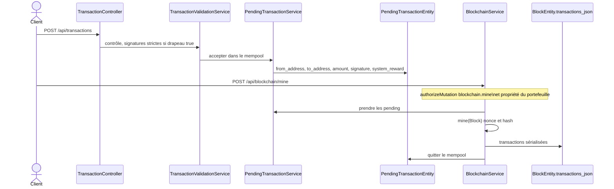

# 57 — Transactions

## Objectif

Cette fiche est une vue complémentaire de la série documentaire 41–60. Elle décrit les transactions de la chaîne native de démonstration : le modèle `Transaction`, le mempool `PendingTransaction` / `PendingTransactionEntity`, le minage, et la signature stricte. Ce n’est pas le format d’une transaction Ethereum.

## Statut

Élevé. Confirmé par le code.

## Sources analysées

- `io.dartchain.backend.blockchain.model.Transaction`
- `PendingTransaction`
- `PendingTransactionEntity` et `V6__blockchain.sql`
- `BlockchainService.minePendingTransactions` et `mine`
- `BlockchainController` POST `/api/blockchain/mine`
- `PendingTransactionController`, `PendingTransactionServiceImpl.minePendingTransaction`
- `TransactionController` POST `/api/transactions`
- `TransactionValidationService`
- `application.yaml` : `dartchain.security.strict-pending-signatures: true`

## Éléments représentés

- Champs d’une transaction confirmée, embarquée ensuite dans le bloc.
- Ligne de mempool, avec `system_reward` booléen.
- Entrée dans le pool, contrôle de signature, minage, écriture dans `transactions_json`.
- Mode strict activé par défaut.

## Diagramme

## Explication

`Transaction` est un objet Java, pas une table. Ses champs sont `id`, `hash`, `sender`, `recipient`, `amount` (`BigDecimal`), `timestamp` (`Long`), `signature`, `systemReward` (`Boolean`), `payload` et `status`. Une fois minée, la liste tient dans `blocks.transactions_json`.

`PendingTransaction` reprend l’idée d’une transaction en attente, avec le booléen `systemReward`. La ligne SQL `pending_transactions` (`PendingTransactionEntity`) nomme autrement une partie des champs : `from_address`, `to_address`, `tx_data`, `tx_hash`, `amount` NUMERIC(38, 26), `signature` TEXT, `status` VARCHAR(32), `system_reward` BOOLEAN NOT NULL DEFAULT FALSE, `created_at` BIGINT. V6 ne pose pas de clé étrangère vers `chain_accounts` ni vers `users`.

Deux entrées de minage coexistent. `BlockchainService.minePendingTransactions(minerAddress)` construit un bloc à partir du pool ; `BlockchainController` l’expose en POST `/api/blockchain/mine` (corps `MineRequest.minerAddress`) et POST `/api/blockchain/mine/{minerAddress}`. Les deux passent par `RoleAuthorizationService.authorizeMutation` (action `blockchain.mine`) et `AuthService.ensureWalletOwnership`. `PendingTransactionServiceImpl.minePendingTransaction(String id)` mine une transaction identifiée, exposée par `PendingTransactionController`. `BlockchainService` contient aussi `mineBlock(String data)` et une méthode privée `mine(Block)` qui ajuste nonce et hash. Le diagramme retient le chemin mempool vers bloc, qui est celui du contrôleur principal.

`dartchain.security.strict-pending-signatures` vaut `true`. `TransactionValidationService` documente un mode permissif déprécié lorsque le drapeau est `false` (commentaire de phase N). Avec le défaut lu, une transaction en attente doit porter une signature acceptée par ce service. La colonne SQL `signature` peut néanmoins être nulle : la contrainte stricte est applicative, pas un `NOT NULL` de V6. `system_reward` permet à une transaction marquée récompense système de suivre une autre règle de signature ; le détail de cette exception n’est pas recopié au-delà du booléen et du drapeau. Le booléen n’est pas un journal d’événements (fiche 59).

`TransactionController` publie `POST /api/transactions` sous le préfixe `/api`. Cette écriture n’est pas dans la liste `permitAll` de `SecurityConfig` : elle tombe sous `.anyRequest().authenticated()`, en plus de la validation métier.

Le faucet place une réclamation dans le mempool et laisse le bloc au minage manuel (`FaucetServiceImpl` : message « Faucet claim placé dans le mempool — miner pour confirmer »). Ce n’est pas une transaction déjà confirmée.

## Correspondance avec le code

| Concept | Ancrage |
| --- | --- |
| Transaction confirmée | `Transaction` |
| Transaction en attente, modèle | `PendingTransaction` |
| Ligne mempool | `PendingTransactionEntity`, table V6 |
| Validation | `TransactionValidationService` |
| Drapeau | `strict-pending-signatures: true` |
| Minage du pool | `BlockchainService.minePendingTransactions` |
| Minage unitaire | `PendingTransactionServiceImpl.minePendingTransaction` |
| HTTP minage | `BlockchainController` `/mine` |
| HTTP soumission | `TransactionController` |
| Stockage confirmé | `BlockEntity.transactionsJson` |
| Mapper | `PendingTransactionMapper` |

Index utiles lus dans V12, sans être des FK : `idx_pending_from`, `idx_pending_to`.

## Hypothèses

- Le mapper aligne `sender` / `fromAddress` et `payload` / `txData`. Les noms divergent dans les types lus ; le corps du mapper n’est pas recopié.
- Une transaction `systemReward` à true peut être produite par le faucet ou par une récompense M4T3R. Les deux services existent ; cette fiche n’attribue pas chaque `true` à un seul appelant sans avoir recopié leurs constructions.

## Anomalies détectées

- Trois vocabulaires pour la même transaction : modèle (`sender`, `payload`), entité (`fromAddress`, `txData`), JSON de bloc (liste `Transaction`).
- Signature obligatoire dans la configuration stricte, facultative dans le SQL.
- Deux API de minage (tout le pool, ou une transaction par id) sans que le diagramme de déploiement les distingue pour le client.
- Pas de table `transactions`. Un outil SQL qui chercherait les mouvements confirmés hors de `transactions_json` ne les trouverait pas.
- La chaîne n’est pas Ethereum : pas de `gas`, pas de nonce EIP-155 sur la transaction elle-même. Le nonce lu est celui de `chain_accounts`, pas un champ de `Transaction`.

## Recommandations

- Garder `strict-pending-signatures` à true dans tous les profils, y compris prod où il est déjà réaffirmé.
- Documenter le mapper comme contrat entre les trois formes, pour qu’un client ne poste pas `sender` à un endpoint qui attend `fromAddress`, ou l’inverse.
- Si les transactions confirmées doivent être interrogeables, extraire une table dans une migration future. Jusque-là, le logique reste le JSON du bloc.
