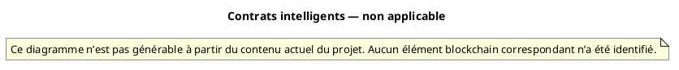

# 58 — Contrats intelligents

## Objectif

Cette fiche est une vue complémentaire de la série documentaire 41–60. Elle constate l’absence de contrat intelligent dans le canon.

Ce diagramme n’est pas générable à partir du contenu actuel du projet. Aucun élément blockchain correspondant n’a été identifié.

## Statut

Non applicable.

## Sources analysées

- Recherche de fichiers `*.sol` dans le canon : aucun résultat.
- `CharacterNftController` (`/api/v1/characters`), lu pour ne pas le confondre avec un contrat.
- `ChainProperties` et `chain_config` : chaîne native de démonstration, chain-id 3377, pas un déploiement de bytecode.
- Mémo de faits : « Aucun smart contract ».

## Éléments représentés

- L’impossibilité de dessiner un contrat : pas de langage Solidity, pas de bytecode, pas d’adresse de contrat.
- L’API applicative `CharacterNftController`, qui existe et n’est pas un contrat on-chain.
- Le renvoi vers les fiches 55 à 57 pour la chaîne native réellement présente.

## Diagramme

## Explication

Ce diagramme n’est pas générable à partir du contenu actuel du projet. Aucun élément blockchain correspondant n’a été identifié.

Le dépôt ne contient aucun fichier `.sol`. Aucune classe lue ne déploie, n’appelle ou ne stocke un contrat. Le chain-id 3377, le jeton R4V3 et les blocs natifs sont une chaîne de démonstration écrite en Java (`Block`, `BlockchainService`). Ils ne tiennent pas lieu de contrat.

`CharacterNftController` est une API applicative. Son préfixe est `ApiRoutes.CHARACTERS_V1_PREFIX`, c’est-à-dire `/api/v1/characters`. Il expose `GET /me` et `GET /{userId}` et délègue à `CharacterNftService`. Le commentaire de classe parle d’une lecture (chemin STL et identifiant). Le commentaire de `me` indique que l’en-tête `Authorization` est optionnel et que, sans en-tête `X-User-Id`, le contrôleur ne parse pas le JWT : un Bearer devient le littéral `authed-user`, sinon le flux suit l’en-tête. Cela reste un endpoint Spring. Ce n’est pas un smart contract, pas une adresse on-chain, pas un événement de journal Ethereum.

Aucun autre contrôleur du canon (portefeuille, échange, faucet, quêtes) n’a été modélisé ici comme un contrat. Les dessiner en Solidity serait les inventer.

## Correspondance avec le code

| Attendu pour un contrat | Constat dans le canon |
| --- | --- |
| Source `.sol` | Aucun fichier |
| Compte de contrat | Non identifié |
| ABI | Non identifié |
| `CharacterNftController` | API REST `/api/v1/characters`, service `CharacterNftService` |

La chaîne qui existe est documentée dans les fiches 55 (blocs), 56 (portefeuilles) et 57 (transactions). Elle ne complète pas ce diagramme.

## Hypothèses

- Aucune. L’absence de `.sol` est un résultat de recherche, pas une déduction.

## Anomalies détectées

- Le nom « NFT » du contrôleur et du service peut laisser croire à un contrat. Le code est une API de personnage.
- `GET /{userId}` et `GET /me` sont des lectures. Avec `GET /**` permitAll, elles sont publiques au sens du filtre, ce qui est un sujet d’autorisation (fiche 51), pas un sujet de contrat.
- `chain_config.addressSchemeDefault` vaut `evm-compatible`. Ce libellé décrit un format d’adresse de la chaîne native. Il ne dépose pas un contrat.

## Recommandations

- Conserver cette fiche au statut non applicable tant qu’aucun source de contrat n’est ajouté au dépôt.
- Nommer l’API personnage comme API de vitrine dans le README, pour qu’elle ne soit pas rangée avec les blocs.
- Si un contrat était introduit plus tard, remplacer la note par un diagramme issu du fichier ajouté, sans réutiliser un modèle inventé aujourd’hui.
