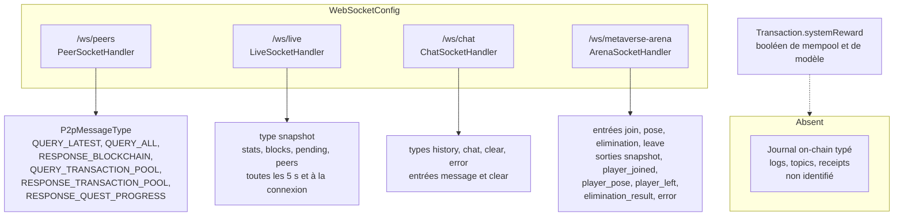

# 59 — Événements

## Objectif

Cette fiche est une vue complémentaire de la série documentaire 41–60. Elle décrit les événements réellement émis par la démo de chaîne native : messages WebSocket des canaux pairs, direct, chat et arène, et le booléen `systemReward` porté par une transaction. Elle n’invente pas un journal d’événements on-chain du type des logs Ethereum. Ce journal typé est absent.

## Statut

Élevé. Canaux et types de messages confirmés par le code. L’absence de log on-chain est un constat de recherche, pas une hypothèse.

## Sources analysées

- `WebSocketConfig`
- `PeerSocketHandler`, `P2pService`, `P2pMessageType`
- `LiveSocketHandler`, `LiveUpdateBroadcastService`
- `ChatSocketHandler`
- `ArenaSocketHandler`
- `Transaction.systemReward`, `PendingTransactionEntity.systemReward`
- Absence de type « event log » générique dans le modèle `Block` / `Transaction`

## Éléments représentés

- Quatre canaux WebSocket, tous enregistrés avec `WebSocketAuthHandshakeInterceptor`.
- Types de messages P2P, live, chat et arène.
- `systemReward` : champ de transaction, pas un topic de log.
- Ce qui manque : logs de contrat, topics, receipts Ethereum, table d’événements.

## Diagramme

## Explication

`WebSocketConfig` enregistre quatre handlers. `/ws/**` est `permitAll` dans `SecurityConfig`. L’intercepteur de poignée de main est tout de même ajouté sur chaque canal. Ce ne sont pas des abonnements à des logs de blocs au sens Ethereum.

Canal pairs, `/ws/peers`. `PeerSocketHandler` délègue le texte à `P2pService.onMessage`. L’énumération `P2pMessageType` contient `QUERY_LATEST`, `QUERY_ALL`, `RESPONSE_BLOCKCHAIN`, `QUERY_TRANSACTION_POOL`, `RESPONSE_TRANSACTION_POOL` et `RESPONSE_QUEST_PROGRESS`. Le service répond à une requête de dernier bloc ou de chaîne entière, accepte une réponse de chaîne, échange le pool de transactions et accepte une réponse de progression de quêtes. Certains types exigent une session authentifiée (`requiresAuthentication`) : sans identité sur la session, le message est ignoré. `broadcastLatest` et `broadcastTransactionPool` diffusent aux pairs connectés. C’est le protocole P2P de la démo.

Canal direct, `/ws/live`. `LiveSocketHandler` ignore les messages du client (commentaire : flux en poussée serveur). À l’ouverture, un snapshot part après 250 ms. `LiveUpdateBroadcastService.broadcastSnapshot` tourne toutes les 5 secondes. Le message a `type` = `snapshot` et `data` contient `stats`, `blocks`, `pendingTransactions` et `peers`. C’est une photo de la chaîne native, pas une liste d’événements typés émis par un contrat.

Canal chat, `/ws/chat`. `ChatSocketHandler` lit `type`. `clear` vide un salon, `message` (défaut si le type manque) enregistre un message, tout autre type renvoie une erreur. Les enveloppes émises sont `history` à la connexion, `chat`, `clear` et `error`. Le salon et l’auteur sont ceux du chat applicatif (`ChatMessageEntity`), y compris l’auteur anonyme.

Canal arène, `/ws/metaverse-arena`. `ArenaSocketHandler` accepte `join`, `pose`, `elimination` et `leave`. Il émet `snapshot`, `player_joined`, `player_pose`, `player_left`, `elimination_result` et `error`. Le commentaire de classe précise que ce canal ne remplace pas live, chat ni peers.

`systemReward` est un booléen de `Transaction`, de `PendingTransaction` et de la colonne `pending_transactions.system_reward` (NOT NULL, défaut FALSE en SQL). Il marque une transaction de récompense système au moment où elle entre dans le mempool ou dans le JSON du bloc. Il n’a pas de topic, pas d’adresse de contrat, pas de table `events`. Le dire ici évite de le chercher comme un log.

Absent, après lecture des modèles de bloc et de transaction et des handlers ci-dessus :

- pas de journal d’événements on-chain typé ;
- pas de receipt avec logs ;
- pas de filtre `eth_getLogs` ni d’équivalent nommé dans les contrôleurs lus ;
- pas d’événement Solidity, puisqu’il n’y a pas de `.sol` (fiche 58).

Les faits de chaîne qui circulent en temps réel passent par le snapshot live et par les messages P2P `RESPONSE_BLOCKCHAIN` / `RESPONSE_TRANSACTION_POOL`.

## Correspondance avec le code

| Canal | Handler | Messages confirmés |
| --- | --- | --- |
| `/ws/peers` | `PeerSocketHandler`, `P2pService` | `P2pMessageType` |
| `/ws/live` | `LiveSocketHandler`, `LiveUpdateBroadcastService` | `snapshot` |
| `/ws/chat` | `ChatSocketHandler` | `history`, `chat`, `clear`, `error` |
| `/ws/metaverse-arena` | `ArenaSocketHandler` | `join`, `pose`, `elimination`, `leave` en entrée ; `snapshot`, `player_joined`, `player_pose`, `player_left`, `elimination_result`, `error` en sortie |
| Récompense | `Transaction.getSystemReward` | booléen, colonne `system_reward` |

`SecurityConfig` ouvre `/ws/**`. L’intercepteur est `WebSocketAuthHandshakeInterceptor`.

## Hypothèses

- La liste `P2pMessageType` est exhaustive pour le protocole P2P : le `switch` de `P2pService.onMessage` couvre chaque valeur lue, sans branche par défaut.
- Le snapshot live inclut les transactions en attente déjà mappées en DTO. Il ne garantit pas un événement par transaction nouvelle entre deux ticks de 5 secondes : un client qui ne lit que le WebSocket peut manquer un état intermédiaire et voir l’état suivant. C’est le rythme `@Scheduled(fixedRate = 5_000)`, pas un bus d’événements.

## Anomalies détectées

- Aucun journal on-chain typé n’existe. Une documentation qui parlerait de « logs de la chaîne » sans préciser le WebSocket serait fausse.
- `/ws/live` pousse des blocs entiers, ce qui duplique l’API REST de lecture. Ce n’est pas un flux d’événements incrémental.
- Le chat et l’arène sont des événements applicatifs rangés à côté de la chaîne dans la même configuration WebSocket. Ils ne modifient pas `Block` par eux-mêmes.
- `systemReward` peut être confondu avec un événement. C’est un champ.

## Recommandations

- Si un journal d’événements devient nécessaire, le créer comme type explicite (table ou liste dans le bloc) plutôt que de surcharger `systemReward` ou le snapshot live.
- Documenter les quatre canaux dans le README : l’aperçu API du README cite `/ws/live` et `/ws/chat`, pas `/ws/peers` ni `/ws/metaverse-arena`, alors que `WebSocketConfig` enregistre les quatre.
- Pour un client qui doit réagir à chaque transaction, s’abonner au snapshot en connaissant son pas de 5 secondes, ou relire `GET` pending / blocs. Il n’y a pas d’autre flux typé.
