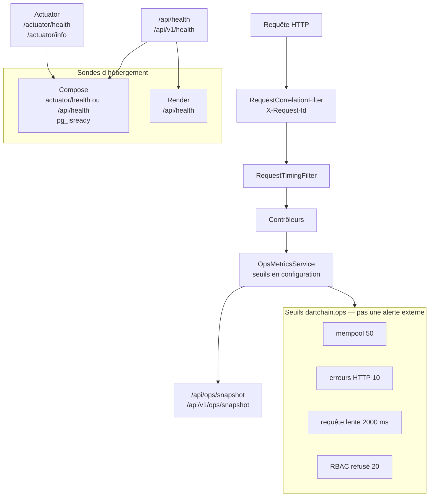

# 60 — Observabilité

## Objectif

Cette fiche est une vue complémentaire de la série documentaire 41–60. Elle décrit les moyens d’observation réellement présents : actuator `health` et `info`, `RequestTimingFilter`, `RequestCorrelationFilter`, seuils d’exploitation en configuration, healthchecks Compose, et JaCoCo. Prometheus et Grafana ne sont pas identifiés comme produits déployés. Les alertes lues sont des seuils dans la configuration et des objets renvoyés par l’API d’exploitation, pas des notifications externes.

## Statut

Moyen. Mécanismes confirmés dans le code. Aucun déploiement Prometheus ou Grafana n’a été constaté ; le nom d’endpoint `prometheus` dans le profil staging est signalé comme identifiant actuator, pas comme un serveur.

## Sources analysées

- `application.yaml` bloc `management` et `dartchain.ops`
- `application-staging.yaml`, `application-prod.yaml` (exposition actuator)
- `RequestTimingFilter`, `RequestCorrelationFilter`
- `OpsMetricsService`, `OpsController`, `OpsV1Controller`
- `HealthController`, `HealthV1Controller`, `PersistenceModeInfoContributor`
- `docker-compose.yml` healthchecks
- `deploy/render.yaml` healthCheckPath `/api/health`
- `apps/dartchain-backend/pom.xml` JaCoCo, ratio `0.65`
- Job CI backend `./mvnw -q verify`

## Éléments représentés

- Sondes `health` et `info`, ouvertes dans la chaîne de sécurité.
- Corrélation `X-Request-Id`.
- Mesure de durée des requêtes et seuil lent à 2000 ms.
- Seuils mempool 50, erreurs HTTP 10, refus RBAC 20.
- Healthchecks Postgres, backend et frontend dans Compose.
- Couverture JaCoCo exigée au `verify`.
- Absence d’un couple Prometheus + Grafana déployé, et absence d’alerte externe inventée.

## Diagramme

## Explication

Le fichier de base expose les endpoints actuator `health,info`. L’accès health est `unrestricted` dans ce fichier, et `SecurityConfig` laisse `/actuator/health`, `/actuator/health/**` et `/actuator/info` en `permitAll`. `dartchain.ops.restrict-actuator` vaut `false` ici, `true` en staging et en prod, où le jeton se nomme `DARTCHAIN_ACTUATOR_TOKEN` (valeur non recopiée). Le profil staging élargit l’exposition à `health,info,metrics,prometheus`. Le profil prod l’élargit à `health,info,metrics`. Le mot `prometheus` est l’identifiant d’un endpoint Spring. `OpsMetricsService` publie `externalStack` = `none` et `observabilityModel` = `native-json`. Aucun conteneur Grafana, aucune datasource Prometheus et aucun dashboard n’ont été identifiés dans Compose ni dans `deploy/render.yaml`. Cette fiche ne les ajoute pas.

`RequestCorrelationFilter` lit l’en-tête `X-Request-Id`. S’il est absent ou vide, il génère douze caractères hexadécimaux issus d’un UUID, le place dans le MDC sous `requestId`, et le renvoie dans la réponse. `GlobalExceptionHandler` et le layout de log JSON s’en servent. `HealthV1Controller` rappelle le nom de cet en-tête.

`RequestTimingFilter` est enregistré par `RequestTimingFilterConfig` et alimente `ApplicationMetricsCollector`. Le seuil de requête lente est `dartchain.ops.slow-request-threshold-ms`, défaut 2000. Les autres seuils lus dans `application.yaml` sont `mempool-alert-threshold` 50, `http-error-alert-threshold` 10 et `rbac-denied-alert-threshold` 20. `OpsMetricsService.buildAlerts` compare ces nombres à des compteurs du processus et ajoute des `OpsAlertResponse` de codes `MEMPOOL_HIGH`, `P2P_DISCONNECTED`, `CHAIN_INVALID` et l’alerte d’erreurs HTTP. Ce sont des objets dans la réponse de snapshot (`/api/ops/snapshot` et `/api/v1/ops/snapshot`). Aucun envoi vers un service d’astreinte n’est décrit dans ce service. Les seuils restent de la configuration.

Compose vérifie Postgres par `pg_isready`. Le healthcheck backend partagé interroge `http://localhost:8080/actuator/health` puis `http://localhost:8080/api/health`. Le frontend default interroge la racine HTTP du conteneur. Render utilise `healthCheckPath: /api/health`. `HealthController` et `HealthV1Controller` incluent le mode de persistance. `PersistenceModeInfoContributor` le republie sur actuator info.

JaCoCo est le plugin `jacoco-maven-plugin` du module backend. Le ratio de lignes minimal est `${jacoco.minimum.line-ratio}` égal à `0.65`. Le job CI `backend` lance `./mvnw -q verify`, ce qui exécute cette barre. Ce n’est pas un tableau de bord de production.

Le format de log indiqué par les métadonnées d’ops est JSON en prod et staging (`loggingFormat` = `json-en-prod-staging`). `application-staging.yaml` met le logger `io.dartchain` en DEBUG ; le profil prod le met en INFO.

## Correspondance avec le code

| Moyen | Ancrage |
| --- | --- |
| Health actuator | `management.endpoints.web.exposure.include` = `health,info` dans le fichier de base |
| Health API | `HealthController`, `HealthV1Controller` |
| Corrélation | `RequestCorrelationFilter.REQUEST_ID_HEADER` = `X-Request-Id` |
| Durée | `RequestTimingFilter` |
| Seuils | propriétés `dartchain.ops.*-threshold` |
| Alertes internes | `OpsMetricsService.buildAlerts` |
| Snapshot | `/api/ops/snapshot`, `/api/v1/ops/snapshot` |
| Compose | ancre `x-backend-healthcheck`, `pg_isready` |
| Render | `healthCheckPath: /api/health` |
| Couverture | `jacoco.minimum.line-ratio` = `0.65` |
| Pile externe | métadonnée `externalStack` = `none` |

## Hypothèses

- L’endpoint actuator nommé `prometheus` dans le seul profil staging peut produire du texte OpenMetrics si la dépendance Micrometer idoine est au classpath. Cette fiche ne l’a pas appelé. Elle refuse d’en déduire un serveur Prometheus ou un Grafana.
- Les alertes `P2P_DISCONNECTED` et `CHAIN_INVALID` n’ont pas de seuil numérique dans `application.yaml` : elles sont des conditions dans `buildAlerts` (pairs enregistrés sans session, chaîne invalide). Elles restent internes au snapshot.

## Anomalies détectées

- Le défaut `restrict-actuator: false` et `permitAll` sur health/info exposent les sondes sans le jeton, alors que staging et prod annoncent une restriction.
- Staging liste `prometheus` dans l’exposition alors que le service d’ops déclare `externalStack` = `none`. Le nom suggère une pile qui n’est pas déployée dans les fichiers lus.
- Les « alertes » n’ont pas de destinataire externe. Un mempool au-dessus de 50 n’envoie rien tout seul.
- JaCoCo gate le build (`verify`) et n’observe pas le runtime.
- Deux URLs de santé coexistent (`/actuator/health` et `/api/health`). Le healthcheck Compose accepte l’une ou l’autre ; Render n’en cite qu’une.

## Recommandations

- Traiter les seuils comme des indicateurs du snapshot d’exploitation, et n’ajouter un pager externe que le jour où un connecteur existera dans le dépôt.
- Si l’endpoint `prometheus` du profil staging n’est pas scrapé, le retirer de `exposure.include` pour que le nom ne mente pas, ou documenter le scraper manquant sans inventer Grafana.
- Aligner Render, Compose et la chaîne Spring sur une sonde unique lorsque `restrict-actuator` est vrai, afin qu’un healthcheck non authentifié reste possible.
- Garder le ratio JaCoCo `0.65` dans le job `backend` de `ci.yml`, déjà couvert par `verify`, et ne pas le présenter comme une métrique de production.
